# Authentication

## 1. Password protection

### 1.1 Password policies (complexity and more)

- A [password policy](https://docs.microsoft.com/azure/active-directory/authentication/concept-password-ban-bad-combined-policy#azure-ad-password-policies) is applied to all user and admin accounts that are created and managed directly in Azure AD. 
- The Azure AD password policy doesn't apply to user accounts synchronized from an on-premises AD environment using Azure AD Connect unless you enable the EnforceCloudPasswordPolicyForPasswordSyncedUsers flag.
- You can't change these settings except as [noted in this table](https://docs.microsoft.com/azure/active-directory/authentication/concept-password-ban-bad-combined-policy#azure-ad-password-policies).

### 1.2 Password expiration policies

#### 1.2.1 Tenant level settings

The following are the [password expiration policies](https://docs.microsoft.com/azure/active-directory/authentication/concept-password-ban-bad-combined-policy#password-expiration-policies) you configure on the tenant lever that impact all users in the directory:

- Password expiry duration. Default value: 90 days.
- Password expiry notification (When users are notified of password expiration). Default value: 14 days before password expires.

#### 1.2.2 User level settings

The following are the [password expiration policies](https://docs.microsoft.com/azure/active-directory/authentication/concept-password-ban-bad-combined-policy#password-expiration-policies) you configure per user:

- A global administrator or user administrator can use the [Microsoft Azure AD Module for Windows PowerShell](https://docs.microsoft.com/powershell/module/Azuread/?view=azureadps-2.0) to set user passwords not to expire.
- By default, only passwords for user accounts that aren't synchronized through Azure AD Connect can be configured to not expire. For more information, [Connect AD with Azure AD.](https://docs.microsoft.com/azure/active-directory/hybrid/how-to-connect-password-hash-synchronization#password-expiration-policy). This impact all users that are sync via the Azure AD Connect.

### 1.3 Banned password list

The Azure AD Identity Protection team constantly analyzes Azure AD security telemetry data looking for commonly used weak or compromised passwords. Weak terms are added to the [global banned password list](https://docs.microsoft.com/azure/active-directory/authentication/concept-password-ban-bad). When a password is changed or reset for any user in an Azure AD tenant, the current version of the global banned password list is used to validate the strength of the password.

- The global banned password list is automatically applied to all users in an Azure AD tenant. There's nothing to enable or configure, and can't be disabled. 
- This global banned password list is applied to users when they change or reset their own password through Azure AD.
- Admin can add their own entries to the [custom banned password list](https://docs.microsoft.com/azure/active-directory/authentication/concept-password-ban-bad#custom-banned-password-list)

#### 1.3.1 Password Protection for Active Directory (on premise)

[Azure AD Password Protection](https://docs.microsoft.com/azure/active-directory/authentication/concept-password-ban-bad-on-premises) detects and blocks known weak passwords and their variants, and can also block additional weak terms that are specific to your organization. On-premises deployment of Azure AD Password Protection uses the same global and custom banned password lists that are stored in Azure AD, and does the same checks for on-premises password changes as Azure AD does for cloud-based changes. These checks are performed during password changes and password reset events against on-premises Active Directory Domain Services (AD DS) domain controllers.

## 2. Blocking legacy authentication

Legacy authentication is a term that refers to an authentication request made by:

- Older Office clients that do not use modern authentication (for example, Office 2010 client)
- Any client that uses legacy mail protocols such as IMAP/SMTP/POP3

Legacy authentication does not support multi-factor authentication (MFA). Even if you have an MFA policy enabled on your directory, a bad actor can authenticate using a legacy protocol and bypass MFA. The best way to protect your account from malicious authentication requests made by legacy protocols is to [block these attempts altogether](https://docs.microsoft.com/azure/active-directory/fundamentals/concept-fundamentals-block-legacy-authentication).

## 3. Authentication, MFA methods and SSPR

Some [authentication methods](https://docs.microsoft.com/azure/active-directory/authentication/concept-authentication-methods) can be used as the primary factor when you sign in to an application or device, such as using a FIDO2 security key or a password. Other authentication methods are only available as a secondary factor when you use Azure AD Multi-Factor Authentication or SSPR.

The following table outlines when an authentication method can be used during a sign-in event:

| Method                         | Primary authentication | Secondary authentication  |
|--------------------------------|:----------------------:|:-------------------------:|
| Windows Hello for Business     | Yes                    | MFA\*                      |
| Microsoft Authenticator app    | Yes                    | MFA and SSPR              |
| FIDO2 security key             | Yes                    | MFA                       |
| OATH hardware tokens           | No                     | MFA and SSPR              |
| OATH software tokens           | No                     | MFA and SSPR              |
| SMS                            | Yes                    | MFA and SSPR              |
| Voice call                     | No                     | MFA and SSPR              |
| Password                       | Yes                    |                           |
| Security questions             | No                     | SSPR                      |

### 3.1 Password authentication

In Azure AD, a password is often one of the primary authentication methods. You can't disable the password authentication method. If you use a password as the primary authentication factor, increase the security of sign-in events using Azure AD Multi-Factor Authentication.

#### 3.1.1 Sign-in with email

You can configure Azure AD to let users [sign in with their email](https://docs.microsoft.com/azure/active-directory/authentication/howto-authentication-use-email-signin) as an alternate login ID. For example, if Contoso rebranded to Fabrikam, rather than continuing to sign in with the legacy _ana@contoso.com_ UPN, email as an alternate login ID can be used. To access an application or service, users would sign in to Azure AD using their non-UPN email, such as _ana@fabrikam.com_.

The feature supports managed authentication with Password Hash Sync (PHS) or Pass-Through Authentication (PTA). The  'proxyAddresses' attribute is read-only and cannot be set using PowerShell.

The feature enables sign-in with ProxyAddresses, in addition to UPN, for cloud-authenticated Azure AD users. 

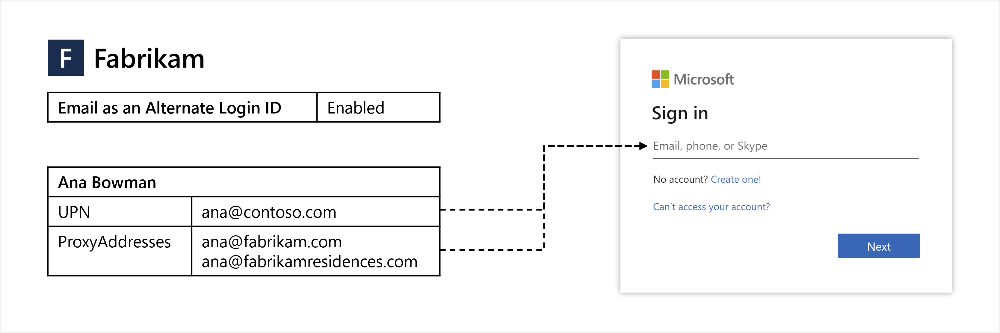

This feature also supports [B2B guest user sign-in](https://docs.microsoft.com/azure/active-directory/authentication/howto-authentication-use-email-signin#b2b-guest-user-sign-in-with-an-email-address) (cross tenant access) with an email address.

### 3.2 Certificate-based authentication

[Certificate Based Authentication (CBA)](https://docs.microsoft.com/azure/active-directory/authentication/concept-certificate-based-authentication) enables administrators to allow or require users to authenticate with X.509 certificates against their Azure AD for applications and browser sign-in.

Before this feature brought cloud-managed support for CBA to Azure AD, customers had to use AD FS to be able to authenticate using X.509 certificates against Azure AD. There are some [limitations](https://docs.microsoft.com/azure/active-directory/authentication/concept-certificate-based-authentication-limitations) you should be aware of. 

The CBA is type of passwordless authentication. On-premises passwords need not be stored in the cloud in any form.

#### 3.2.1 Admin experience

There are some configuration steps to complete before enabling Azure AD CBA. For more information, check out the [How to configure Azure AD certificate-based authentication](https://docs.microsoft.com/azure/active-directory/authentication/how-to-certificate-based-authentication) article.

To configure the certification authorities you can use [Azure Portal](https://docs.microsoft.com/azure/active-directory/authentication/how-to-certificate-based-authentication#configure-certification-authorities-using-the-azure-portal), or [PowerShell](https://docs.microsoft.com/azure/active-directory/authentication/how-to-certificate-based-authentication#configure-certification-authorities-using-powershell)

#### 3.2.2 User experience

During sign-in, users enter their username into the Azure AD sign-in page, and then select **Next**. Then the users will see an option to authenticate with a certificate instead of entering a password. If multiple matching certificates are present on the device, the user can pick which one to use. The certificate is validated, the binding to the user account is checked, and if successful, they are signed in.

The following screen shows the first sign-in page where the user enters their UPN:

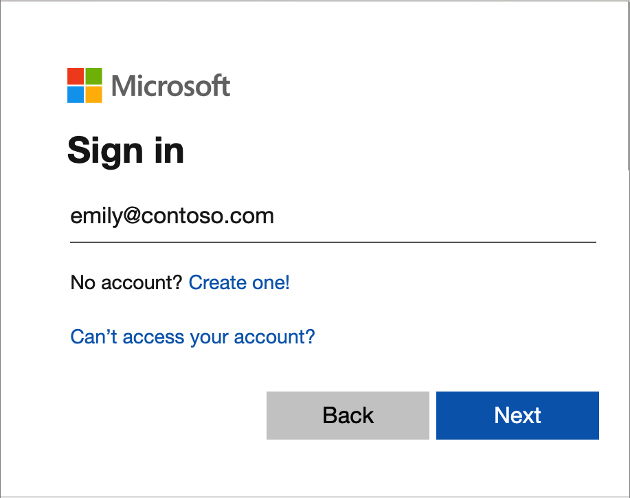

The following screen shows the second sign-in page where a user can select to **Sign in with a certificate**:

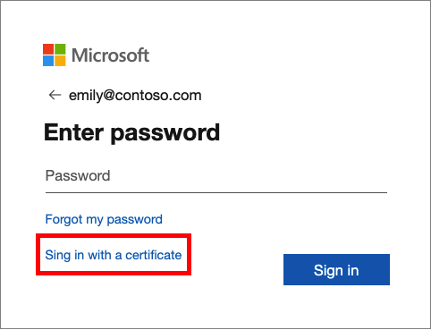

Note, if admin has enabled other authentication methods like Phone sign-in or FIDO2, users may see a different sign-in screen.

##### 3.2.1.1 Windows SmartCard logon

Azure AD users can authenticate using X.509 certificates on their [SmartCards directly against Azure AD at Windows logon](https://docs.microsoft.com/azure/active-directory/authentication/concept-certificate-based-authentication-smartcard). There is no special configuration needed on the Windows client to accept the SmartCard authentication. A join machine or a hybrid environment (hybrid join) is required.

The user presents a physical or virtual SmartCard to the test machine. Then, select **SmartCard** icon, enter the PIN and authenticate the user.

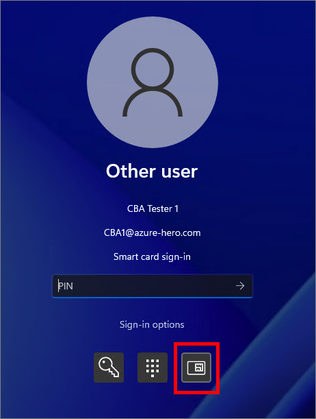

##### 3.2.1.2 Mobile devices

[Android and iOS devices](https://docs.microsoft.com/azure/active-directory/authentication/concept-certificate-based-authentication-mobile) can use certificate-based authentication (CBA) to authenticate to Azure AD using a client certificate on their device when connecting to:

- Office mobile applications such as Microsoft Outlook and Microsoft Word
- Exchange ActiveSync (EAS) clients

Azure AD certificate-based authentication (CBA) is supported for certificates on-device on native browsers as well as on Microsoft first-party applications on both iOS and Android devices.

### 3.3 Temporary Access Pass authentication

A [Temporary Access Pass (TAP)](https://docs.microsoft.com/azure/active-directory/authentication/howto-authentication-temporary-access-pass) is a time-limited passcode issued by an admin that satisfies strong authentication requirements and can be used to:

- Onboard other authentication methods, including Passwordless ones such as Microsoft Authenticator or even Windows Hello.
- Recovery when a user has lost or forgotten their strong authentication factor like a FIDO2 security key or Microsoft Authenticator app, but needs to sign in to register new strong authentication methods.
- Alternative MFA method when an MFA device is not available. For example, a user forgot to bring their phone to the office, and need access to organization resource. 

In all of the scenarios above, an admin can issue a time-limited passcode allowing the user to security sign-in with the passwoce as a first or second factor authentication. 

#### 3.3.1 Admin experience

Before anyone can sign-in with a TAP, admin needs to [enable](https://docs.microsoft.com/azure/active-directory/authentication/howto-authentication-temporary-access-pass#enable-the-temporary-access-pass-policy) TAP in the authentication method policy and choose which users and groups can sign in by using a TAP and lifetime of passes created in the tenant.

After admin enables a policy, they can [create a TAP](https://docs.microsoft.com/azure/active-directory/authentication/howto-authentication-temporary-access-pass#create-a-temporary-access-pass) for a user in Azure AD. From the user profile page, select **Add authentication methods**, and choose **Temporary Access Pass**. 

The following screenshot shows how to create a TAP:

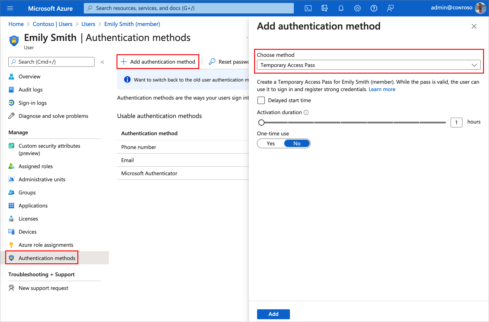

Once added, the details of the TAP are shown. Make a note of the actual TAP value. You provide this value to the user. You can't view this value after you select Ok. The following screenshot shows a TAP create by administrator:

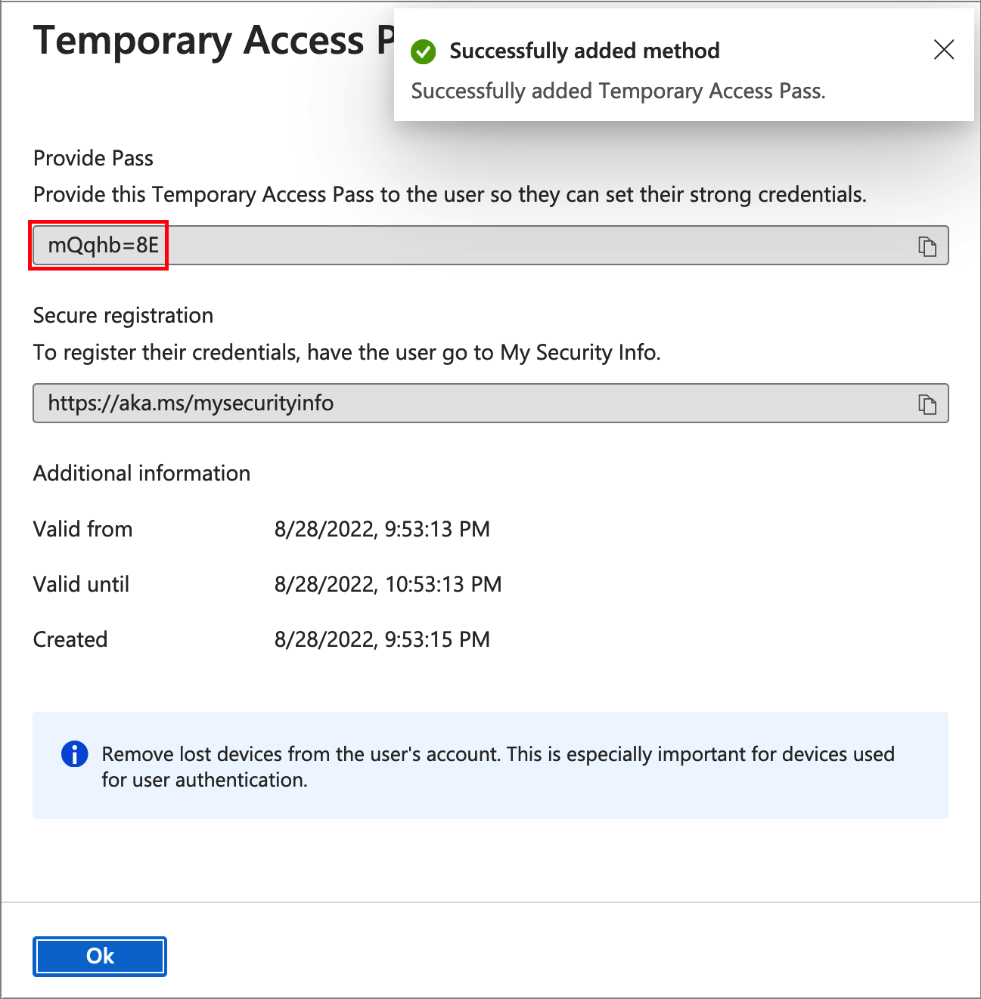

#### 3.3.2 User experience

The most common use for a TAP is for a user to register authentication details during the first sign-in or device setup, without the need to complete extra security prompts. Authentication methods are registered at <https://aka.ms/mysecurityinfo>. Users can also update existing authentication methods here.

Note, you can also test the TAP by navigating to the <https://myapps.microsoft.com> portal, or any other application.

User enters the UPN of the account you created the TAP for, such as emily@contoso.com.

If the user is included in the TAP policy, they'll see a screen to enter their TAP. The user needs to enter the TAP that was displayed in the Azure portal.

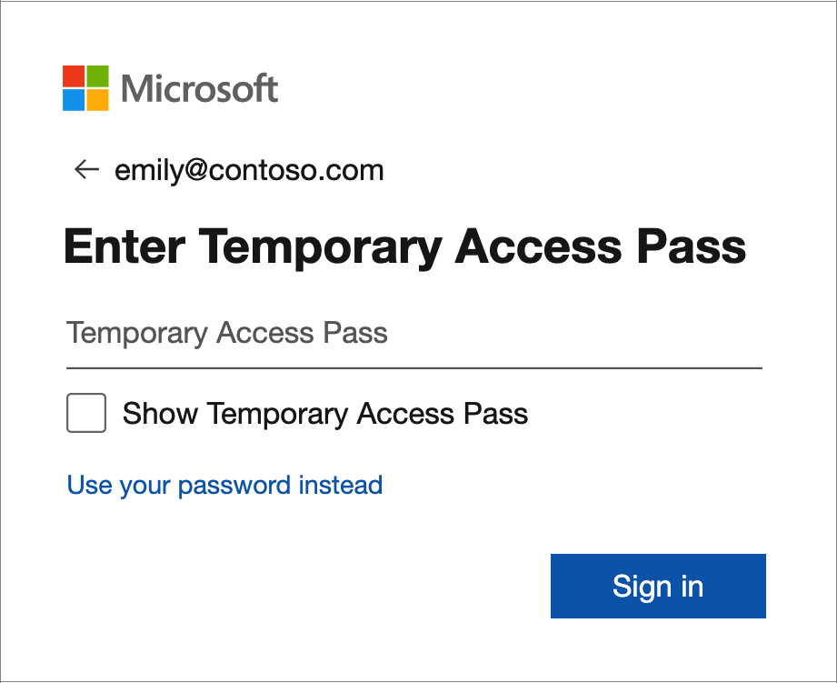

### 3.4 Time-based One Time Password

[OATH TOTP](https://docs.microsoft.com/azure/active-directory/authentication/concept-authentication-oath-tokens#oath-hardware-tokens-preview) (Time-based One Time Password) is an open standard that specifies how one-time password (OTP) codes are generated. OATH TOTP authentication can be used as second factor authentication, not as a primary authentication.

OATH TOTP can be implemented using either software or hardware to generate the codes. Azure AD doesn't support OATH HOTP, a different code generation standard.

- [OATH software tokens](https://docs.microsoft.com/azure/active-directory/authentication/concept-authentication-oath-tokens#oath-software-tokens) - Software OATH tokens are typically applications such as the Microsoft Authenticator app and other authenticator apps. Azure AD generates the secret key, or seed, that's input into the app and used to generate each OTP.
- [OATH hardware tokens](https://docs.microsoft.com/azure/active-directory/authentication/concept-authentication-oath-tokens#oath-software-tokens) - Azure AD supports the use of OATH-TOTP SHA-1 tokens that refresh codes every 30 or 60 seconds. Customers can purchase these tokens from the vendor of their choice.
  - **Onboarding process**: Once tokens are acquired they must be uploaded in a comma-separated values (CSV) file format including the UPN, serial number, secret key, time interval, manufacturer, and model

### 3.5 Security questions

Security questions aren't used as an authentication method during a sign-in event. Instead, [security questions](https://docs.microsoft.com/azure/active-directory/authentication/concept-authentication-security-questions) can be used during the self-service password reset (SSPR) process to confirm who you are. Administrator accounts can't use security questions as verification method with SSPR.

When users register for SSPR, they're prompted to choose the authentication methods to use. If they choose to use security questions, they pick from a set of questions to prompt for and then provide their own answers.

#### 3.5.1 Admin experience

The admin configure the Security questions in Azure Portal => **Azure Active Directory** => **Password reset** => **Authentication methods**. It's not under the **Security** option like the other methods.

#### 3.5.2 User experience

To use security questions authentication, users can register at the security info registration <https://aka.ms/setupsecurityinfo>. The following screenshot shows how a user can add a security  authentication method.

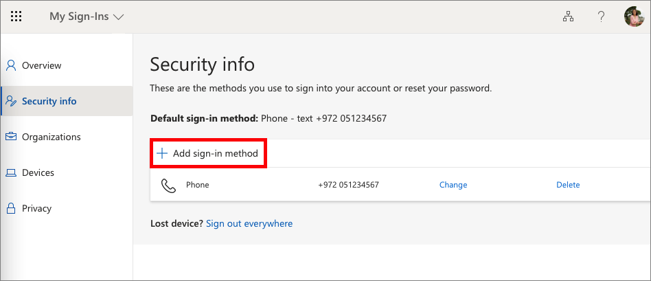

Then select the **security questions** authentication option.

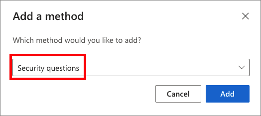

The user is asked to pick from a set of questions to prompt for and provide their own answers.

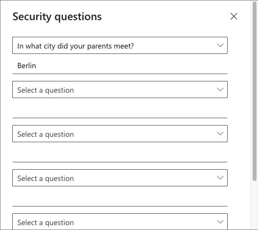

During the sign-in, if a user selects **Can't access your account?**, or navigate to <https://aka.ms/sspr>. Then provide their UPN.

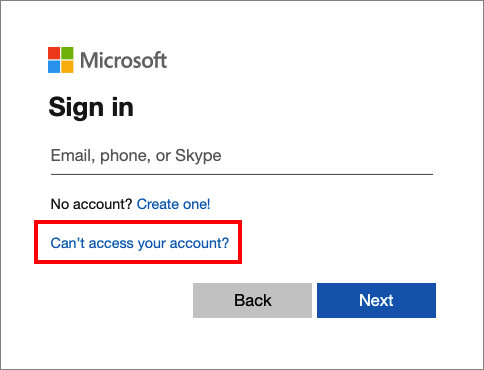

After providing the UPN, the users is asked random questions from the pool of the security questions:

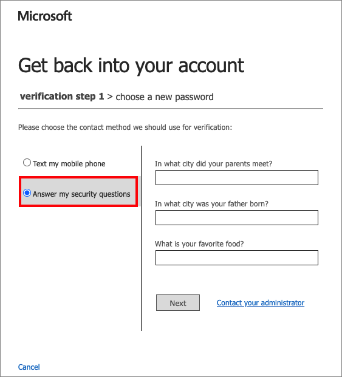](./media/authentication/security-questions-5.png)

