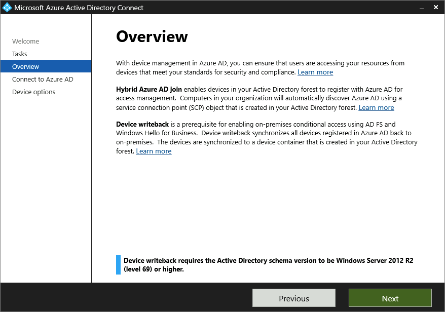
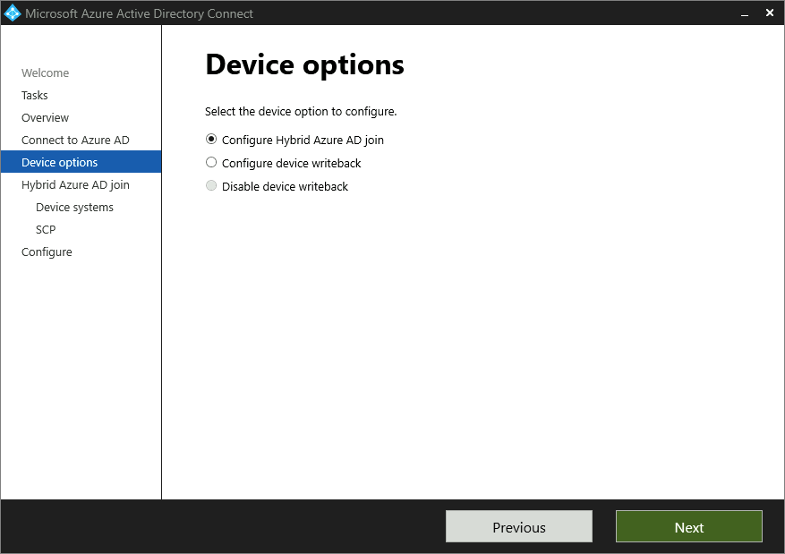
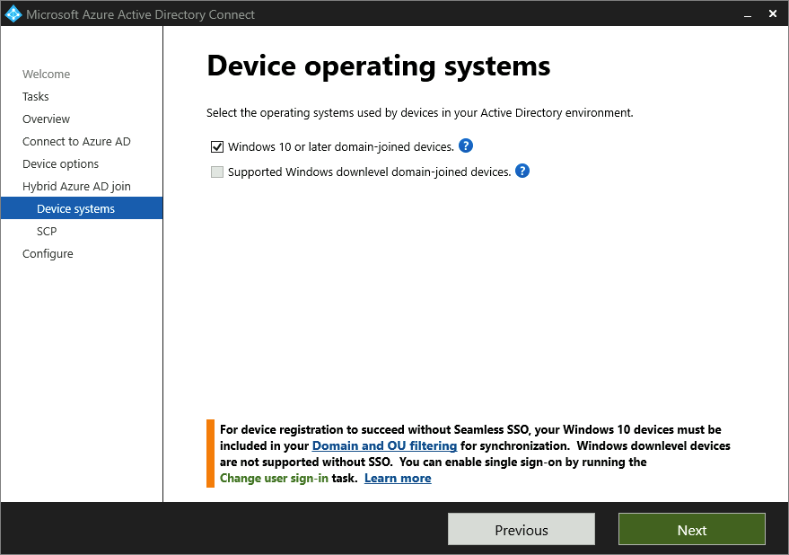

# Configure Windows down-level hybrid Azure AD join

## Join a Windows 7 device to Active Directory domain services

To run this demo, create a Windows 7 VM and join it to the Active Directory (not AAD). Follow these steps to join Windows 7 workstation/VM to AD:

1. From the **System Properties**, select **Computer Name** tab, then select **Change**.

     

1. Provide a **Computer name**, and the **Domain** of your Active Directory.

     

1. Provide the an Active Directory admin credentials. When asked, restart your the VM.

     


1. To confirm that the machine is a domain joined, in your **Domain Controller**, check the **Active Directory Users and Computers** console.

    

## Configure hybrid Azure AD join

> If you already configure hybrid Azure AD join, skip this section.

Learn how to [Configure hybrid Azure AD join](https://docs.microsoft.com/azure/active-directory/devices/howto-hybrid-azure-ad-join). In this demo, we configure the _contos.com_ Active Directory Domain Services to the Azure AD _kingdir.biz_ tenant.

Configure hybrid Azure AD join by using Azure AD Connect for a managed domain:

1. Start Azure AD Connect, and then select **Configure**.
1. In **Additional tasks**, select **Configure device options**, and then select **Next**.

    

1. In **Overview**, select **Next**.

    

1. In **Connect to Azure AD**, enter the credentials of a global administrator for your **Azure AD** tenant.

    

1. In **Device options**, select **Configure Hybrid Azure AD join**, and then select **Next**.

    

1. In **Device operating systems**, select the operating systems that devices in your Active Directory environment use, and then select **Next**.

    


1. In **SCP configuration**, for each forest where you want Azure AD Connect to configure the SCP, complete the following steps, and then select **Next**.
   1. Select the **Forest**.
   1. Select an **Authentication Service**.
   1. Select **Add** to enter the enterprise administrator credentials.

    

1. In **Ready to configure**, select **Configure**.
1. In **Configuration complete**, select **Exit**.
1. Optionally, if you add a computer and want to start the sync. Run the following PowerShell commands:
    
    ```powershell
    Import-Module ADSync
    Start-ADSyncSyncCycle -PolicyType Delta

    #Or: Start-ADSyncSyncCycle -PolicyType Initial
    ```

## Configure the Windows 7 machine

To register Windows downlevel devices, organizations must install [Microsoft Workplace Join for non-Windows 10 computers](https://www.microsoft.com/download/details.aspx?id=53554) on every non-Windows 10 computers you want to join to the Azure AD.

1. Run the _Workplace_x64.msi_ or _Workplace_x32.msi_ file you have download, and select **Install**.

    

1. Select **Finish** to completed the installation and start the **Windows Setup Wizard**.

    

1. To [retrieve the registration status](https://docs.microsoft.com/azure/active-directory/devices/troubleshoot-hybrid-join-windows-legacy), sign on with the user account that has performed a hybrid Azure AD join.
Open the command prompt and type:

    ```powershell
    "%programFiles%\Microsoft Workplace Join\autoworkplace.exe" /i
    ```
    For example:

    

1. If the device was not hybrid Azure AD joined, you can attempt to do hybrid Azure AD join by clicking on the "Join" button. If the attempt to do hybrid Azure AD join fails, the details about the failure will be shown.

    


