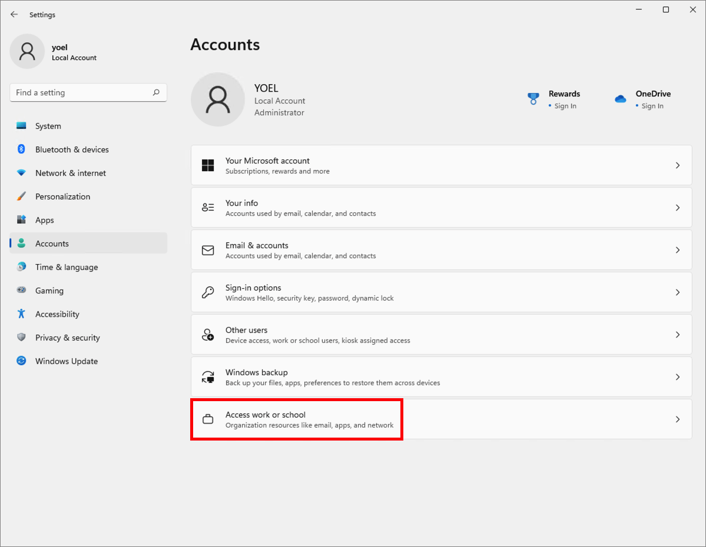
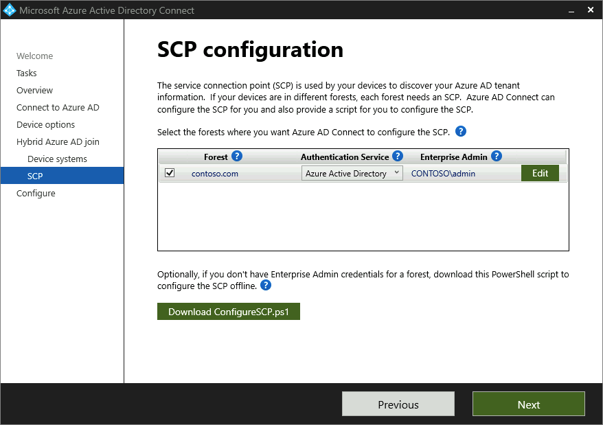

# Configure hybrid Azure AD join

## Join a Windows 11 device to Active Directory domain services

To run this demo, create a Windows 11 VM and join it to the Active Directory (not AAD). Follow these steps to join Windows 11 workstation/VM to AD:

1. From **Settings**, select **Accounts** and then **Access work or school**.

     

1. From **Access work or school** page, select **Connect**

     

1. From the **Set up work or school account**, select **Join this device to a local Active Directory domain**.

     

1. Provide the **Domain name** of your Active Directory.

     

1. Provide the an Active Directory admin credentials.

     

1. Select an account that will be added to this machine. In the following screenshot, **admin** (account) will be assigned with the **Administrator** permissions.

     

1. To confirm that the machine is a domain joined, log-in and check the system info.

     

1. You should be able to find the computer in the **Active Directory Users and Computers** console.

    

## Configure hybrid Azure AD join

Learn how to [Configure hybrid Azure AD join](https://docs.microsoft.com/azure/active-directory/devices/howto-hybrid-azure-ad-join). In this demo, we configure the _contos.com_ Active Directory Domain Services to the Azure AD _kingdir.biz_ tenant.

Configure hybrid Azure AD join by using Azure AD Connect for a managed domain:

1. Start Azure AD Connect, and then select **Configure**.
1. In **Additional tasks**, select **Configure device options**, and then select **Next**.

    

1. In **Overview**, select **Next**.

    

1. In **Connect to Azure AD**, enter the credentials of a global administrator for your **Azure AD** tenant.

    

1. In **Device options**, select **Configure Hybrid Azure AD join**, and then select **Next**.

    

1. In **Device operating systems**, select the operating systems that devices in your Active Directory environment use, and then select **Next**.

    


1. In **SCP configuration**, for each forest where you want Azure AD Connect to configure the SCP, complete the following steps, and then select **Next**.
   1. Select the **Forest**.
   1. Select an **Authentication Service**.
   1. Select **Add** to enter the enterprise administrator credentials.

    

1. In **Ready to configure**, select **Configure**.
1. In **Configuration complete**, select **Exit**.
1. Optionally, if you add a computer and want to start the sync. Run the following PowerShell commands:
    
    ```powershell
    Import-Module ADSync
    Start-ADSyncSyncCycle -PolicyType Delta
    ```

## Confirm the devices are hybrid joined

Here are [three ways](https://docs.microsoft.com/azure/active-directory/devices/howto-hybrid-join-verify) to locate and verify the hybrid joined device state. First, you can access the devices overview by completing these steps:

1. Sign in to the [Microsoft Entra](https://entra.microsoft.com).
1. Select **Devices**, then select **All devices**.

    If the **Registered** column says **Pending**, then hybrid Azure AD join hasn't completed. In federated environments, this state happens only if it failed to register and Azure AD Connect is configured to sync the devices. Wait for Azure AD Connect to complete a sync cycle. If the **Registered** column contains a **date/time**, then hybrid Azure AD join has completed. For more information, [pending devices in Azure AD](https://docs.microsoft.com/troubleshoot/azure/active-directory/pending-devices) and [troubleshoot hybrid Azure AD-joined devices](https://docs.microsoft.com/azure/active-directory/devices/troubleshoot-hybrid-join-windows-current).

    The following screenshot shows the _DomainJoinedWin_ Windows 11 VM is joined to the kingdir.biz Azure AD tenant.

    

1. Locally on the device, open Windows PowerShell and run thr following command:

    ```powershell
    dsregcmd /status
    ```

    Verify that both **AzureAdJoined** and **DomainJoined** are set to **YES**. You can use the **DeviceId** and compare the status on the service using either the Azure portal or PowerShell.

