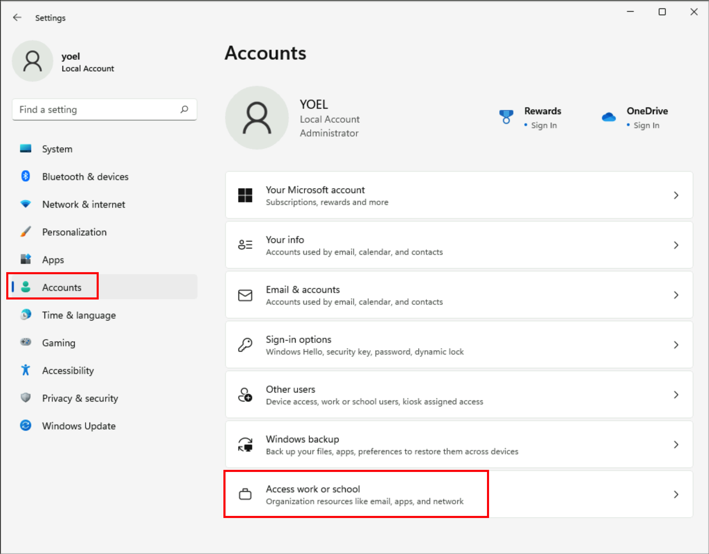
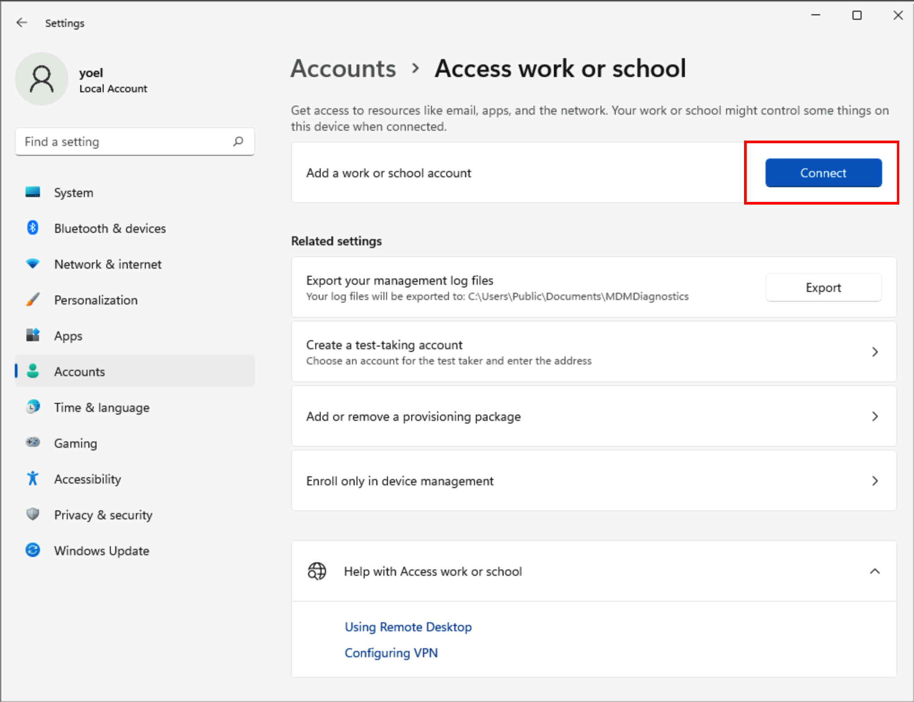
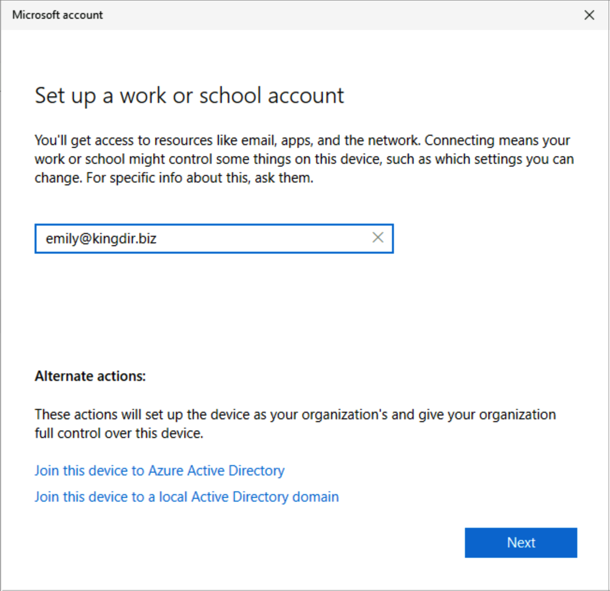
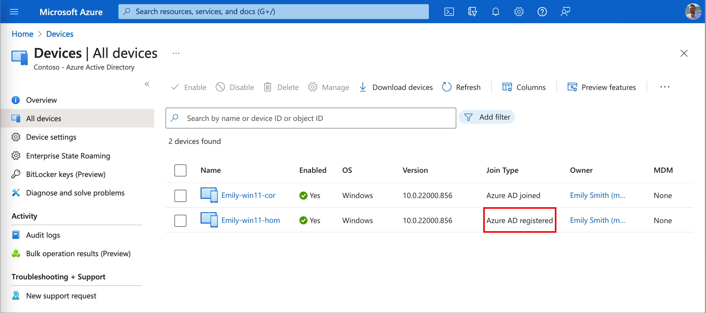
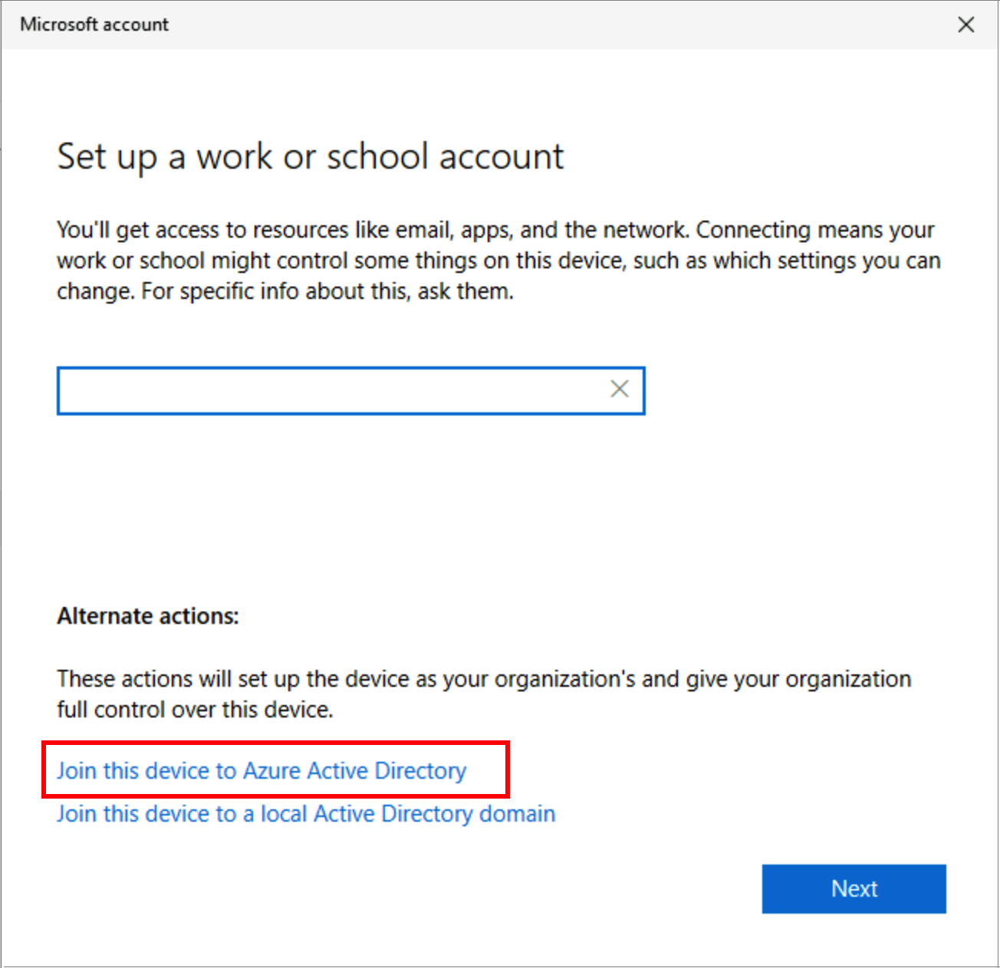
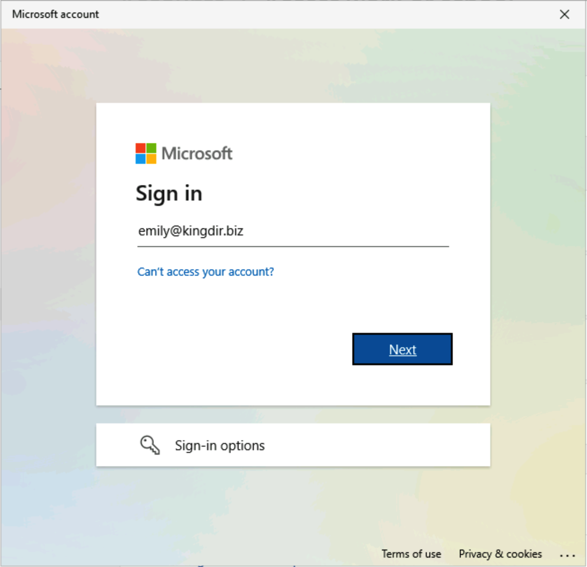
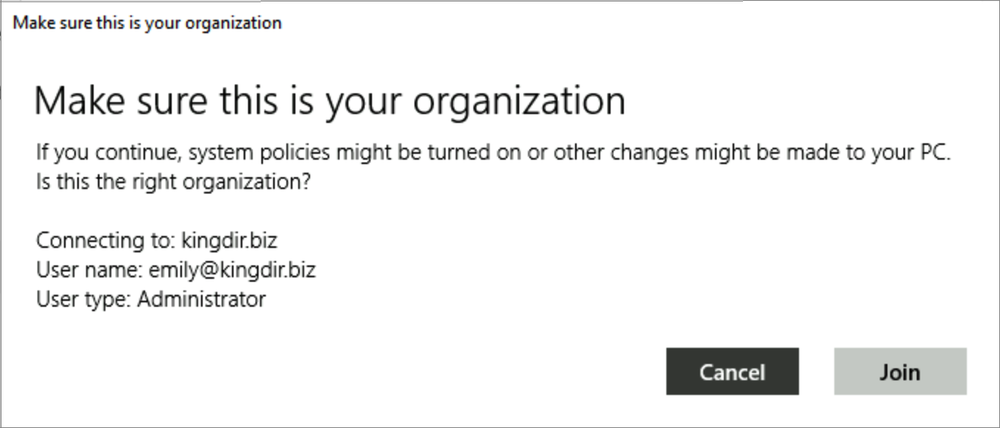
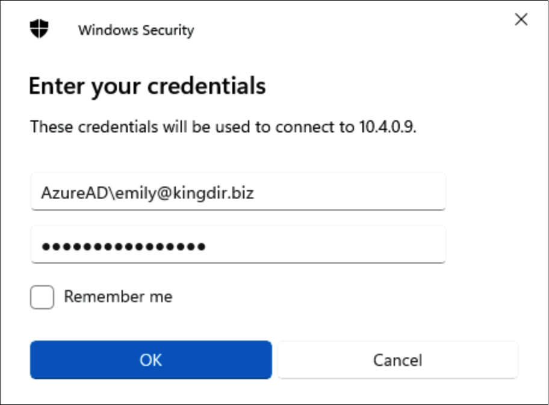
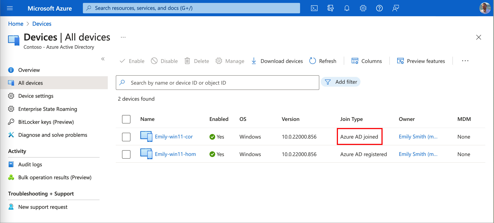

# Device identity

>**Draft** version!!!

A device identity is an object in Azure AD similar to users, groups, or applications. It gives admins information they can use when making access or configuration decisions. For example, [device-based Conditional Access policies](https://docs.microsoft.com/azure/active-directory/conditional-access/concept-conditional-access-grant) and Mobile Device Management with [Microsoft Endpoint Manager](https://docs.microsoft.com/mem/endpoint-manager-overview).

> TIP: For the complete list of available feature, check out the [Comparison matrix](https://docs.microsoft.com/azure/active-directory/devices/plan-device-deployment#comparison-matrix).

|Scenario   | Operating System| Provisioning| Sign in options| Device management| 
|---------|---------|---------|---------|---------|
| [Azure AD registration](https://docs.microsoft.com/azure/active-directory/devices/concept-azure-ad-register)| Windows 10 or newer, iOS, Android, and macOS | <ul><li>**Windows** 10 or newer: settings</li><li>**iOS/Android**: Company Portal or Microsoft Authenticator app</li><li>**macOS:** Company Portal</li></ul>| <ul><li>End-user local credentials</li><li>Password</li><li>Windows Hello</li><li>PIN</li><li>Biometrics or pattern for other devices</li></ul>| <ul><li>Mobile Device Management (example: Microsoft Intune)</li><li>Mobile Application Management</li></ul>|  
| [Azure AD join](https://docs.microsoft.com/azure/active-directory/devices/concept-azure-ad-join)| Windows 11, or 10 | <ul><li>Self-service: Windows Out of Box Experience (OOBE) or Settings</li><li>Bulk enrollment</li><li>Windows Autopilot</li></ul>|Organizational accounts using: <ul><li>Password</li><li>Windows Hello for Business</li><li>FIDO2.0 security keys</li></ul>| <ul><li>Mobile Device Management (example: Microsoft Intune)</li><li>[Configuration Manager with Microsoft Intune](https://docs.microsoft.com/mem/configmgr/comanage/overview)</li></ul>|  
| [Hybrid Azure AD join](https://docs.microsoft.com/azure/active-directory/devices/concept-azure-ad-join-hybrid)| Windows 11, 10, or 8.1   Windows Server (1)| See the list below (2)| Organizational accounts using: <ul><li>Password</li><li>Windows Hello for Business for Win10 and above</li></ul>| <ul><li>[Group Policy](https://docs.microsoft.com/mem/configmgr/comanage/faq#my-environment-has-too-many-group-policy-objects-and-legacy-authenticated-apps--do-i-have-to-use-hybrid-azure-ad-)</li><li>[Configuration Manager with Microsoft Intune](https://docs.microsoft.com/mem/configmgr/comanage/overview)</li></ul>| 

Appendix:

1. Windows Server 2008/R2, 2012/R2, 2016, 2019 and 2022
1. Provisioning for Hybrid Azure AD join:
    - Windows 11, Windows 10, Windows Server 2016/2019/2022
    - Domain join by IT and autojoin via Azure AD Connect or ADFS config
    - Domain join by Windows Autopilot and autojoin via Azure AD Connect or ADFS config
    - Windows 8.1, Windows Server 2012 R2, Windows Server 2012, and Windows Server 2008 R2 - Require MSI

There are three ways to get a device identity as described in this section.

## 1. Azure AD registration

The goal of [Azure AD registered devices](https://docs.microsoft.com/azure/active-directory/devices/concept-azure-ad-register) (also known as Workplace joined devices) is to provide your users with support for bring your own device (BYOD) or mobile device scenarios. In these scenarios, a user can access your organization’s resources using **personal devices**.

- **Sign-in**
    - **Device login** - Users sign-in to the device (for example, Windows, Mac, iPhone, or Android login screen) using their local account (not an Azure AD account). 
    - **Organizational resource** (Single sign-in On) - These devices have an Azure AD account for access to organizational resources, such as <https://myapps.microsoft.com> without the need to reauthenticate.
- **Access control** - Access to resources in the organization can be limited based on that Azure AD account and Conditional Access policies applied to the device identity.
- **Device management** - you can control the devices using Mobile Device Management (MDM) tools like Microsoft Intune. MDM provides a means to enforce organization-required configurations like requiring storage to be encrypted, password complexity, and security software kept updated.

### 1.1 Registering devices

During the device registration, a "device object" is created Azure AD. Then a certificate is pushed to the device. Azure AD trust that device by the certificate that has been issued and pushed to the device. 

Device are registered by users [installing the Company portal app](https://docs.microsoft.com//mem/intune/user-help/sign-in-to-the-company-portal).  

### 1.1.1 Windows 10 registration without Intune

For Windows 10 and later, to register a personal device on your work or school network, follow the [user guide](https://support.microsoft.com/account-billing/register-your-personal-device-on-your-work-or-school-network-8803dd61-a613-45e3-ae6c-bd1ab25bf8a8). 

The following screenshot shows how a user register Windows 11 device.

The following screenshot shows how connect with an Azure AD account.

The following screenshot shows how Emily sings-in to the kingdir.biz Azure AD account.

The following screenshot shows the device object of Emily's Windows 11:

TIP: you can run the `dsredcmd /status` command on your windows machine to get more information about the registered device.

## 2. Azure AD join

Azure AD join enables you to transition towards a cloud-first model with Windows. If you're planning to modernize your devices management and reduce device-related IT costs, Azure AD join provides a great foundation towards achieving those goals

- **Sign-in**
    - **Device login** - Users sign-in to the device with an Azure AD account (not a local account). 
    - **Organizational resource** - Single sign-in On with the Azure AD account
- You can [join devices directly](https://docs.microsoft.com/azure/active-directory/devices/azureadjoin-plan) to Azure Active Directory (Azure AD) without the need to join to on-premises Active Directory.
- Single sign-on (SSO) access [to on-premises resources](https://docs.microsoft.com/azure/active-directory/devices/azuread-join-sso) is also available to devices that are Azure AD joined.
- Azure AD joined devices are signed in to using an organizational Azure AD account.
- Supports Windows 10 and Windows 11 devices. Isn't supported on previous versions of Windows or other operating systems. If you have Windows 7/8.1 devices, you must upgrade at least to Windows 10 to deploy Azure AD join.

### 2.1 Windows 10 registration without Intune

The following screenshot shows how a user joins a Windows 11 device.

The following screenshot shows how to connect with an Azure AD account.

The following screenshot shows how to **Join this device to Azure Active Directory**.

The following screenshot shows how Emily sings-in to the kingdir.biz Azure AD account.

The following screenshot shows how to confirm the administrator account.

After the device join process is completed, log-out and log-in again with the Azure AD account. For login to a remote desktop, follow the steps in the [Connect to remote Azure Active Directory-joined PC](https://docs.microsoft.com/windows/client-management/connect-to-remote-aadj-pc) article.

The following screenshot shows the device object of Emily's Windows 11:

TIP: you can run the `dsredcmd /status` command on your windows machine to get more information about the registered device.

## 3. Hybrid Azure AD join

If you have an on-premises Active Directory environment and you want to join your **AD domain-joined** computers to **Azure AD**, you can accomplish this task by doing [hybrid Azure AD join](https://docs.microsoft.com/azure/active-directory/devices/hybrid-azuread-join-plan). Learn more: [Hybrid Azure AD joined devices](https://docs.microsoft.com/azure/active-directory/devices/concept-azure-ad-join-hybrid)

- Azure AD Connect, or Azure AD could sync is required and the computers must be in the scope of the sync.
- [SSO](https://docs.microsoft.com/azure/active-directory/devices/azuread-join-sso) must be set (see also <https://docs.microsoft.com/en-us/azure/active-directory/hybrid/how-to-connect-sso>) 

### 3.1 Windows current devices

### 3.2 Windows down-level devices

To register Windows down-level devices, organizations must install [Microsoft Workplace Join for non-Windows 10 computers](https://www.microsoft.com/download/details.aspx?id=53554) available on the Microsoft Download Center. The installer creates a scheduled task on the system that runs in the user context. The task is triggered when the user signs in to Windows. The task silently joins the device with Azure AD with the user credentials after authenticating with Azure AD.

### 3.3 Staged Rollout

https://docs.microsoft.com/azure/active-directory/hybrid/how-to-connect-staged-rollout