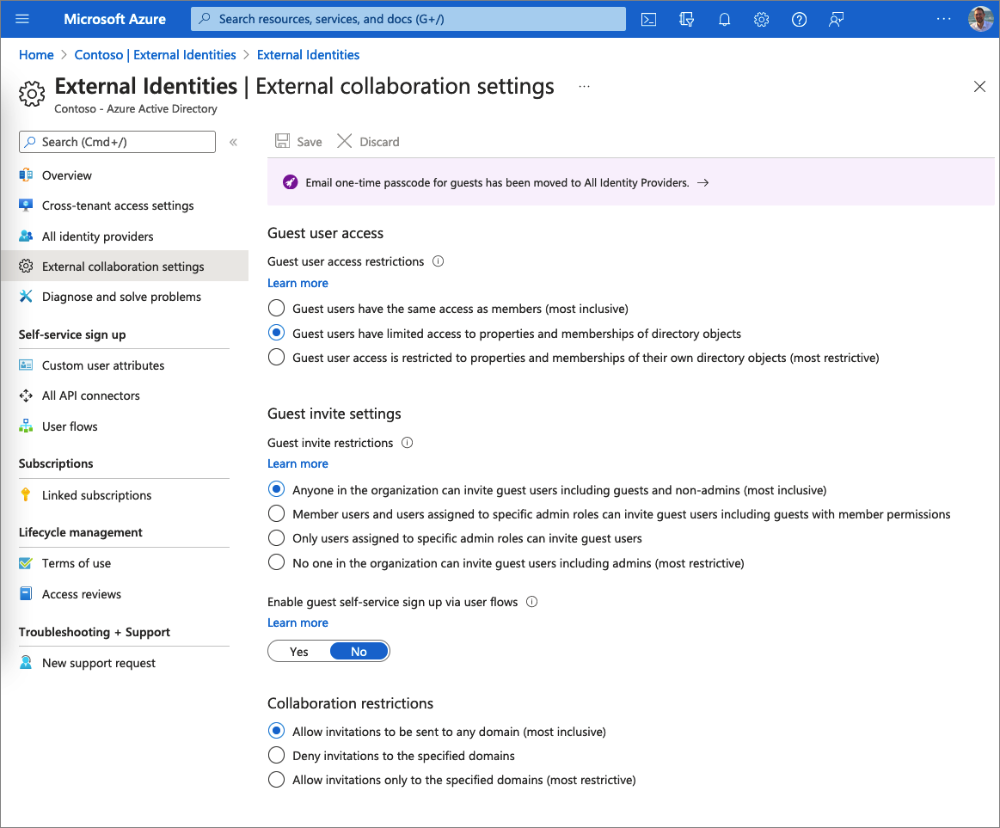
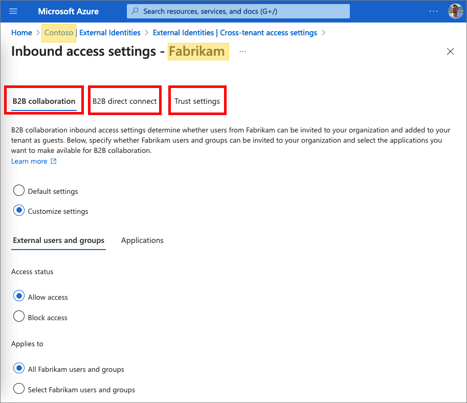

# External Identities

Azure AD External Identities refers to all the ways you can securely interact with users outside of your organization. If you want to collaborate with partners, distributors, suppliers, or vendors, you can share your resources and define how your internal users can access external organizations. 

With External Identities, external users can "bring their own identities." Whether they have a corporate or government-issued digital identity, or an unmanaged social identity like Google or Facebook, they can use their own credentials to sign in. The external user’s identity provider manages their identity, and you manage access to your apps with Azure AD or Azure AD B2C to keep your resources protected.

## 1. B2B collaboration

Azure AD B2B collaboration lets you invite guest users to collaborate with your organization. You can also configure a mutual trust with other organizations. The following table lists the options that are available: 

| Type (3) | Identity | Admin experience| User experience| Scope  |
|---------|---------|---------|---------|---------|
| B2B collaboration | [Azure AD](https://docs.microsoft.com/azure/active-directory/external-identities/azure-ad-account) | Invite users (1), and [self-sign up](https://docs.microsoft.com/azure/active-directory/external-identities/self-service-sign-up-overview) | Authenticate with their home organization. | Any Azure AD tenant. Tenant admin can allow, or disallow domains.  Admin can also [restrict access](https://docs.microsoft.com/azure/active-directory/external-identities/cross-tenant-access-settings-b2b-collaboration) to users and groups and select which applications to share.|
| B2B collaboration| Identity providers| Invite users (1), and [self-sign up](https://docs.microsoft.com/azure/active-directory/external-identities/self-service-sign-up-overview)| Authenticate with their identity provider.| [Microsoft account](https://docs.microsoft.com/azure/active-directory/external-identities/microsoft-account), [Google](https://docs.microsoft.com/azure/active-directory/external-identities/google-federation), [Facebook](https://docs.microsoft.com/azure/active-directory/external-identities/facebook-federation), and [SAML/WS-Fed identity providers](https://docs.microsoft.com/azure/active-directory/external-identities/direct-federation) |
| B2B collaboration| [Email one-time passcode](https://docs.microsoft.com/azure/active-directory/external-identities/one-time-passcode) (2)| Invite users (1), and [self-sign up](https://docs.microsoft.com/azure/active-directory/external-identities/self-service-sign-up-overview)| Email one-time passcode | Any email address|
| [B2B direct connect](https://docs.microsoft.com/azure/active-directory/external-identities/cross-tenant-access-settings-b2b-direct-connect)| Azure AD| Mutual trust | Authenticate with their home organization.| Tenants that are configured with mutual trust. Admin can also [restrict access](https://docs.microsoft.com/azure/active-directory/external-identities/cross-tenant-access-settings-b2b-collaboration) to users and groups and select which applications to share. |
| [Microsoft Azure global cloud and Microsoft Azure Government](https://docs.microsoft.com/azure/active-directory/external-identities/cross-cloud-settings)| Azure AD | Mutual trust| Authenticate with their home organization.| Microsoft Azure global cloud and Microsoft Azure Government and China 21Vianet.| 
| [Internal guests](https://docs.microsoft.com/azure/active-directory/external-identities/user-properties) (4) | Azure AD |Setting up internal credentials for them and designating them as guests by setting the user object UserType to Guest. | Credentials manage by your tenant, such as username and password. | Users are manged by your tenant.|

Notes:

1. You can now invite guest users by [sending out a direct link](https://docs.microsoft.com/azure/active-directory/external-identities/add-user-without-invite) to a shared app. With this method, guest users no longer need to use the invitation email, except in some special cases. A guest user select the app link, reviews and accepts the privacy terms, and then seamlessly accesses the app.
1. [Invited users will receive a one-time passcode](https://docs.microsoft.com/azure/active-directory/external-identities/one-time-passcode#when-does-a-guest-user-get-a-one-time-passcode) if they don't have an Azure AD account, Microsoft account, or the inviting tenant didn't set up federation with social (like Google) or other identity providers.
1. B2B collaboration users are represented in your directory, typically as guest users. B2B direct connect users are NOT represented in your directory, but they're visible from within the Teams shared channel and can be monitored in Teams admin center reports.
1. If you have internal guest users like these, you can [invite them to use B2B collaboration](https://docs.microsoft.com/azure/active-directory/external-identities/invite-internal-users) instead. These B2B guest users will be able to use their own identities and credentials to sign in, and you won’t need to maintain passwords or manage account lifecycles.

## 2. External identities

This section describes the type of external identities admins can configure in their tenant.

### 2.1 Identity providers

An identity provider creates, maintains, and manages identity information while providing authentication services to applications. When sharing your apps and resources with external users, Azure AD is the default identity provider for sharing. This means when you invite external users who already have an Azure AD or Microsoft account, they can automatically sign in without further configuration on your part. External Identities offers a [variety of identity providers](https://docs.microsoft.com/azure/active-directory/external-identities/identity-providers) users can sign-in, such as Google, Facebook and SAML identity providers.

### 2.2 B2B direct connect

With [Azure AD B2B direct connect](https://docs.microsoft.com/azure/active-directory/external-identities/b2b-direct-connect-overview) you can establish a mutual, two-way trust with another Azure AD organization for seamless collaboration. It allows users to seamlessly sign in to your shared resources and vice versa. B2B direct connect users are NOT added as guests to your Azure AD directory.

- When two organizations mutually enable B2B direct connect, users authenticate in their home organization and receive a token from the resource organization for access. 
- B2B direct connect enables the Teams Connect shared channels feature, which lets your users collaborate with external users from multiple organizations with a Teams shared channel for chat, calls, file-sharing, and app-sharing. A shared channel owner can search for allowed users from the external organization and add them to the shared channel. External users can access the Teams shared channel without having to switch organizations or sign in with a different account. 

B2B direct connect is [established through mutual trust](https://docs.microsoft.com/azure/active-directory/external-identities/cross-tenant-access-settings-b2b-direct-connect). Both you and the other organization need to enable B2B direct connect with each other in your cross-tenant access settings.

### 2.3 Microsoft cloud settings for B2B collaboration

You can establish mutual B2B collaboration between the [Microsoft Azure clouds](https://docs.microsoft.com/azure/active-directory/external-identities/cross-cloud-settings) for USA and China clouds.

### 2.4. Email one-time passcode

The [email one-time passcode feature](https://docs.microsoft.com/azure/active-directory/external-identities/one-time-passcode) is a way to authenticate B2B collaboration users when they can't be authenticated through other means, such as Azure AD, Microsoft account (MSA), or social identity providers. When a B2B guest user tries to redeem your invitation or sign in to your shared resources, they can request a temporary passcode, which is sent to their email address. Then they enter this passcode to continue signing in.

### 2.5 Local guest

Before Azure AD B2B collaboration was available, it was common to collaborate with distributors, suppliers, vendors, and others by setting up internal credentials for them and designating them as guests by setting the user object UserType to Guest. If you have internal guest users like these, you can [invite them](https://docs.microsoft.com/azure/active-directory/external-identities/invite-internal-users) to use B2B collaboration instead so they can use their own credentials, allowing their external identity provider to manage authentication and their account lifecycle.

## 3. Create a B2B account

There are various ways to add external users to your organization for B2B collaboration, as described in this section.

### 3.1 Invite users

Invite users to B2B collaboration using their Azure AD accounts, Microsoft accounts, or social identities that you enable, such as Google. An admin can use the Azure portal or PowerShell to invite users to B2B collaboration. The user signs into the shared resources using a simple redemption process with their work, school, or other email account.

### 3.2 Add users without an invitation link or email

You can now invite guest users by [sending out a direct link](https://docs.microsoft.com/azure/active-directory/external-identities/add-user-without-invite) to a shared app. With this method, guest users no longer need to use the invitation email, except in some special cases. A guest user select the app link, reviews and accepts the privacy terms, and then seamlessly accesses the app.

### 3.3 Self-service sign-up 

Lets external users [sign up](https://docs.microsoft.com/azure/active-directory/external-identities/self-service-sign-up-overview) for applications themselves. The experience can be customized to allow sign-up with a work, school, or social identity (like Google or Facebook). You can also collect information about the user during the sign-up process.

#### 3.3.1 Custom attributes

For each application, you might have different requirements for the information you want to collect during sign-up. Azure AD comes with a built-in set of information stored in attributes, such as Given Name, Surname, City, and Postal Code. With Azure AD, you can [extend the set of attributes](https://docs.microsoft.com/azure/active-directory/external-identities/user-flow-add-custom-attributes) stored on a guest account when the external user signs up through a user flow.

#### 3.3.2 Language customization

Language customization allows to [customize languages](https://docs.microsoft.com/azure/active-directory/external-identities/user-flow-customize-language) to modify the strings displayed to users as part of the attribute collection process during sign up. Microsoft provides the translations for 36 languages. Even if your experience is provided for only a single language, you can customize the attribute names on the attribute collection page.

#### 3.3.3 Use API connectors

You can use [API connectors](https://docs.microsoft.com/azure/active-directory/external-identities/api-connectors-overview) to integrate your self-service sign-up user flows with web APIs to customize the sign-up experience and integrate with external systems. For example, with API connectors, you can: perform identity verification, validate user input data, or Run custom business logic.

### 3.4 Entitlement management

Use [Azure AD entitlement management](https://docs.microsoft.com/azure/active-directory/external-identities/self-service-portal), an identity governance feature that lets you manage identity and access for external users at scale by automating access request workflows, access assignments, reviews, and expiration.

### 3.5 Local guest

Setting up internal credentials for them and designating them as guests by setting the user object UserType to Guest. 

## 4. External collaboration settings

_Applies to:_ B2B collaboration, B2B direct connect (partially), social identities (partially)

[External collaboration settings](https://docs.microsoft.com/azure/active-directory/external-identities/external-collaboration-settings-configure) let you specify what roles in your organization can invite external users for B2B collaboration. The following options are available:

- **Determine guest user access**: Azure AD allows you to restrict what external guest users can see in your Azure AD directory. For example, you can limit guest users' view of group memberships, or allow guests to view only their own profile information.

- **Specify who can invite guests**: By default, all users in your organization, including B2B collaboration guest users, can invite external users to B2B collaboration. If you want to limit the ability to send invitations, you can turn invitations on or off for everyone, or limit invitations to certain roles.

- **Enable guest self-service sign-up via user flows**: For applications you build, you can create user flows that allow a user to sign up for an app and create a new guest account. You can enable the feature in your external collaboration settings, and then [add a self-service sign-up user flow to your app](https://docs.microsoft.com/azure/active-directory/external-identities/self-service-sign-up-user-flow).

- **Allow or block domains**: You can use collaboration restrictions to allow or deny invitations to the domains you specify. For details, see [Allow or block domains](https://docs.microsoft.com/azure/active-directory/external-identities/allow-deny-list).

The following screenshot shows how the Contoso tenant collaborates with other organizations, and non-Azure AD identities, such as social identities:

For B2B collaboration with other Azure AD organizations, you should also review your [Cross-tenant access](#31-cross-tenant-access-settings) (next section in this article).

### 4.1 Cross-tenant access settings

_Applies to:_ B2B collaboration, B2B direct connect

[Cross-tenant access settings](https://docs.microsoft.com/azure/active-directory/external-identities/cross-tenant-access-overview) manages how organizations collaborate with other Azure AD organizations and other Microsoft Azure clouds through B2B collaboration B2B direct connect. It gives organizations granular control over how external Azure AD organizations collaborate with your organization (inbound access) and how your users collaborate with external Azure AD organizations (outbound access). These settings also let you trust multi-factor authentication (MFA) and device claims from other Azure AD organizations. You can configure:

- **B2B collaboration** with other Azure AD organizations, use cross-tenant access settings to manage inbound and outbound B2B collaboration and scope access to specific users, groups, and applications.
- **B2B direct connect**, use organizational settings to set up a mutual trust relationship with another Azure AD organization. Both your organization and the external organization need to mutually enable B2B direct connect by configuring inbound and outbound cross-tenant access settings.
- **Trust settings** (inbound), determine whether your Conditional Access policies will trust the multi-factor authentication (MFA), compliant device, and hybrid Azure AD joined device claims from an external organization if their users have already satisfied these requirements in their home tenants.

You can configure [organizational-specific settings](https://docs.microsoft.com/azure/active-directory/external-identities/cross-tenant-access-overview#organizational-settings) by adding an organization and modifying the inbound and outbound settings for that organization. Organizational settings take precedence over [default cross-tenant access settings](https://docs.microsoft.com/azure/active-directory/external-identities/cross-tenant-access-overview#default-settings). The following screenshot shows the **Contoso** Inbound cross-tenant access for the **Fabrikam** tenant.

## 5. Grant B2B users to on-premises applications

You can [provide B2B users access to on-premises apps](https://docs.microsoft.com/azure/active-directory/external-identities/hybrid-cloud-to-on-premises). These on-premises apps can use SAML-based authentication or integrated Windows authentication (IWA) with Kerberos constrained delegation (KCD)

## 6. Auditing and reporting

With guest users, you have auditing capabilities similar to with member users. You can use the [Audit logs](https://docs.microsoft.com/azure/active-directory/external-identities/auditing-and-reporting#audit-logs) and [access reviews](https://docs.microsoft.com/azure/active-directory/external-identities/auditing-and-reporting) to periodically verify whether guest users still need access to your resources.

## 7. Billing model for Azure AD External Identities

Azure Active Directory (Azure AD) External Identities pricing is based on [monthly active users (MAU)](https://docs.microsoft.com/azure/active-directory/external-identities/external-identities-pricing), which is the count of unique users with authentication activity within a calendar month.