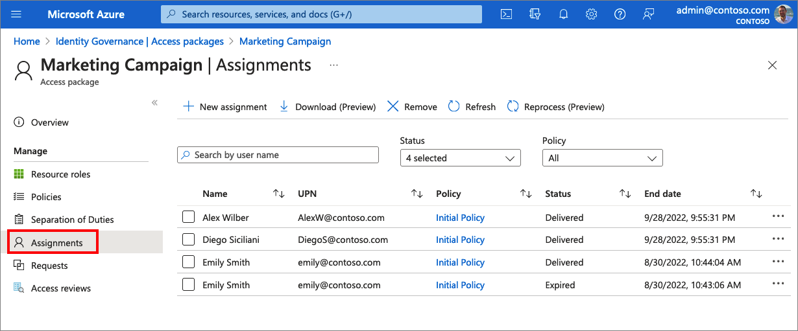
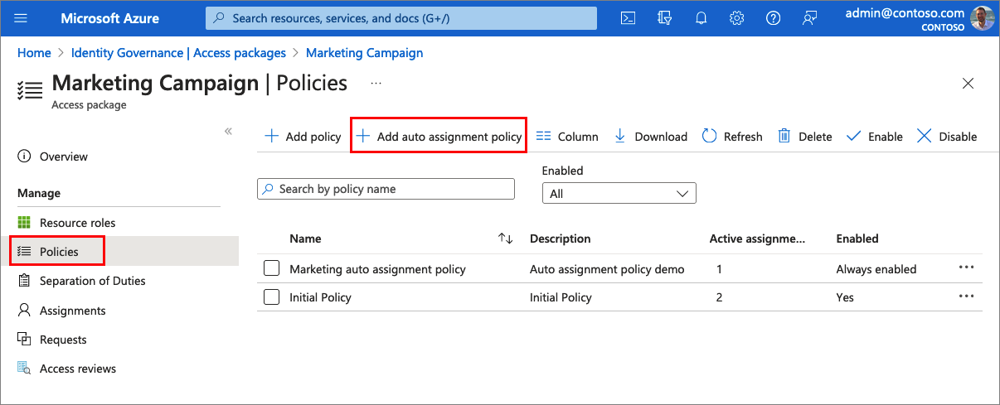
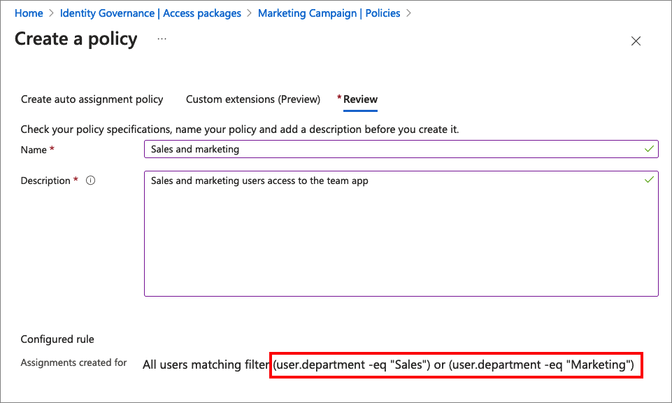
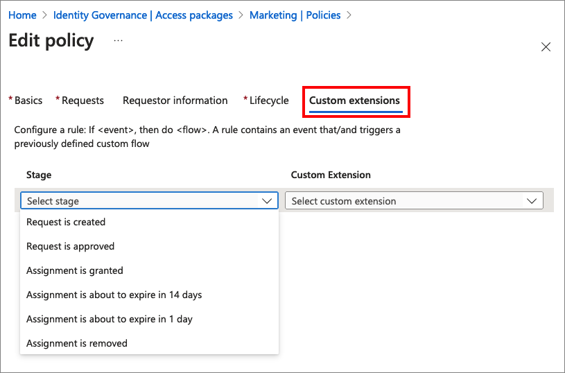

# Azure AD Identity Governance

Identity Governance provides you with capabilities to ensure that the right people have the right access to the right resources. It allows you to mitigate access risk by protecting, monitoring, and auditing access to critical assets while ensuring employee and business partner productivity.

## 1. Entitlement management (ELM)

_Licensing_: P2

The [entitlement management](https://docs.microsoft.com/azure/active-directory/governance/entitlement-management-overview) is an identity governance feature that enables organizations to manage identity and access lifecycle, by automating access request workflows, access assignments, reviews, and expiration.

With an [access package](https://docs.microsoft.com/azure/active-directory/governance/entitlement-management-access-package-create), an administrator or delegated access package manager lists the resources (groups, apps, and sites), and the roles the users need for those resources.

Access packages also include one or more policies. A policy defines the rules or guardrails for assignment to access package. Each policy can be used to ensure that only the appropriate users are able to have access assignments, and the access is time-limited and will expire if not renewed.

### 1.1 Administrator experience

1. Creates a new access package that is associated with a [catalog](TBD).
1. Selects the **Resource roles**; Teams and security groups, applications, or SharePoint sites. Once you've selected the resources, in the *Role* list, select the role you want users to be assigned for the resource. For example, if you select a security group, then you can select whether the assigned users will be the owners or members of this group. If you select an application, then you can choose the [app roles](https://docs.microsoft.com/azure/active-directory/develop/howto-add-app-roles-in-azure-ad-apps) as defined in the **Azure Active Directory** > **App registrations** > **App roles**.
1. On the **Requests** tab, you specify who can request the access package and also approval settings. 
1. On the **Requestor information** you can collect information and attributes from requestor. For example, "What is your main office?", "Have you informed your manager that you need access?". This questions will be shown to the user during the request access flow.
1. On the **Lifecycle** tab, you specify when a user's assignment to the access package expires. You can also specify whether users can extend their assignments.
1. Finally you [copy the My Access portal link](https://docs.microsoft.com/azure/active-directory/governance/entitlement-management-access-package-first) and share it with the users. Note, users can also go directly to the <https://myaccess.microsoft.com> portal and check their access packages.

> Note a single access package may have multiple access policies. For example, an access package manager might configure an access package with two policies for two groups of internal employees. The first policy might allow access for 60 days and require approval. The second policy might allow access for 2 days and not require approval.

#### 1.1.1 View, add, and remove assignments for an access package

In Azure AD entitlement management, you can see [who has been assigned to access packages](https://docs.microsoft.com/azure/active-directory/governance/entitlement-management-access-package-assignments), their policy, and status. The following screenshots shows the _Marketing Campaign_ access package's assignments. Note, that Emily Smith has two assignments, one which expired.

 

#### 1.1.2 Directly assign users

In some cases, you might want to directly assign specific users to an access package so that users don't have to go through the process of requesting the access package. You can [directly assign users](https://docs.microsoft.comazure/active-directory/governance/entitlement-management-access-package-assignments#directly-assign-a-user) by selecting them manually.

You can also create a **auto assignment policy** where users will automatically get access to this package based on specific filter criteria. For example, all users from the _Marketing_ _Sales_ departments will be automatically be assigned (without the user need to request access).

 

The following example shows how to create the sales and marketing auto assignment policy filter:

 

### 1.2 User experience

1. Navigate to a link shared by administrator, or go directly to the <https://myaccess.microsoft.com> portal.
1. Select the access package and submit a request. Users have to provide **Business justification**, **Request for specific period** (with in the time window as specified the the admin in the access policy), and additional information required by the access policy, such as "your main office".
1. Depending on the access policy, the request may be granted immediately or starts the approval flow.

> When you request access to an access package, your request might be denied or your request might expire if approvers don't respond in time. If you need access, you can try again and resubmit your request

For more information about the user flow, check out the [Request access to an access package in Azure AD entitlement management](https://docs.microsoft.com/azure/active-directory/governance/entitlement-management-request-access) article.

### 1.3 Catalog of resources

A catalog is a container of resources and access packages. You create a catalog when you want to group related resources and access packages. The catalog isn't shown to the end user.

The catalog allows you:

- Specify [attributes](https://docs.microsoft.com/azure/active-directory/governance/entitlement-management-catalog-create#add-resource-attributes-in-the-catalog) are required fields that requestors will be asked to answer before they submit their access request. Their answers for these attributes will be shown to approvers and also stamped on the user object in Azure AD
- [Delegate to an access package manager](https://docs.microsoft.com/azure/active-directory/governance/entitlement-management-delegate-managers)
- [Trigger custom Logic Apps](https://docs.microsoft.com/azure/active-directory/governance/entitlement-management-logic-apps-integration)

### 1.4 Custom Extensions

[Custom Extensions](https://docs.microsoft.com/azure/active-directory/governance/entitlement-management-logic-apps-integration) allows you to use Azure Logic Apps to automate custom workflows and connect apps and services in one place. These Logic Apps can then be triggered to run in accordance with entitlement management use cases such as when an access package is granted or requested. For example, an admin could create and link a custom Logic App to entitlement management so that when a user requests an access package, a Logic App is triggered that ensures the user is also assigned certain characteristics in a 3rd party SAAS app (like Salesforce) or is sent a custom email.

The following screenshot demonstrates how to integrate Logic Apps into the policy lifecycle:

 

## 2. Access reviews

_Licensing_: P2

[Access reviews](https://docs.microsoft.com/azure/active-directory/governance/access-reviews-overview) enable organizations to efficiently manage group memberships, access to enterprise applications, and role assignments. User's access can be reviewed on a regular basis to make sure only the right people have continued access.

With access review you can:

- Create and perform an access review [for users](https://docs.microsoft.com/azure/active-directory/governance/manage-access-review#create-and-perform-an-access-review-for-users). For example, you can check many users have administrative access, how many of them are Global Administrators, and if there are any invited guests or partners that have not been removed after being assigned to do an administrative task. You can also recertify the role assignments.
- Ask **sponsors** to review a guest's membership [in a group](https://docs.microsoft.com/azure/active-directory/governance/manage-access-review#ask-a-sponsor-to-review-a-guests-membership-in-a-group), an [application](https://docs.microsoft.com/azure/active-directory/governance/manage-access-review#ask-guests-to-review-their-own-access-to-an-application), or [in general](https://docs.microsoft.com/azure/active-directory/governance/manage-access-review#ask-guests-to-review-their-need-for-access-in-general). You can ask a sponsor, such as the owner of a group, to review a guest's need for continued membership in a group, or an application.
- Ask **guests** to review their own membership [in a group](https://docs.microsoft.com/azure/active-directory/governance/manage-access-review#ask-guests-to-review-their-own-membership-in-a-group), or [application](https://docs.microsoft.com/azure/active-directory/governance/manage-access-review#ask-guests-to-review-their-own-access-to-an-application). You can use access reviews to ensure that users who were invited and added to a group continue to need access. You can easily ask guests to review their own membership in that group, or an application.
- Check access based on a security group. For example, manage users that are [excluded from Conditional Access policies](https://docs.microsoft.com/azure/active-directory/governance/conditional-access-exclusion), or [users accessing with legacy authentication](https://docs.microsoft.com/azure/active-directory/governance/conditional-access-exclusion#example-2-access-review-for-users-accessing-with-legacy-authentication). In both cases the users are member of a security group that excluded from conditional access policy.
- [Create an access review of an access package](https://docs.microsoft.com/azure/active-directory/governance/entitlement-management-access-reviews-create). To reduce the risk of stale access, you can enable periodic reviews of users who have active assignments to an access package in Azure AD entitlement management.

