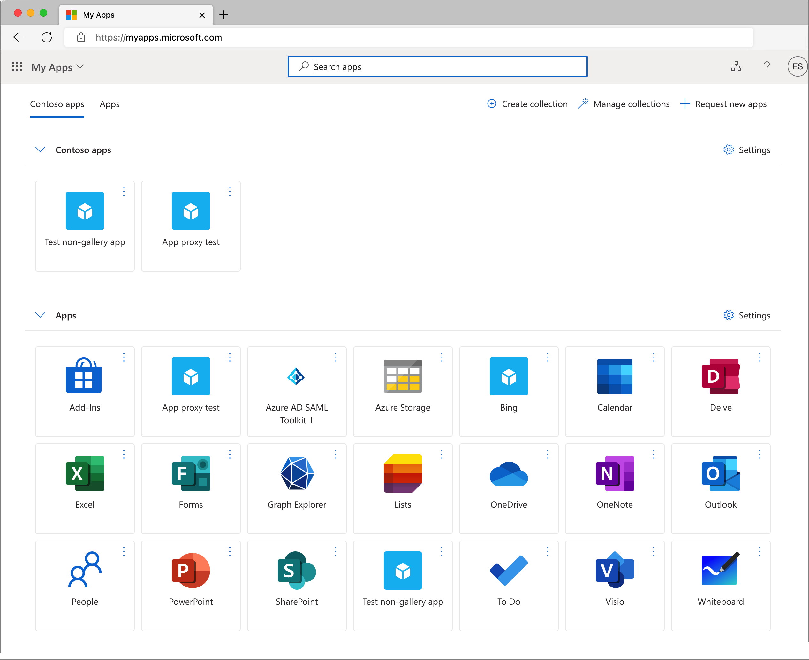
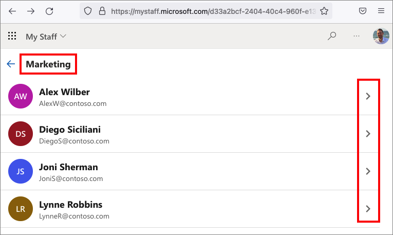
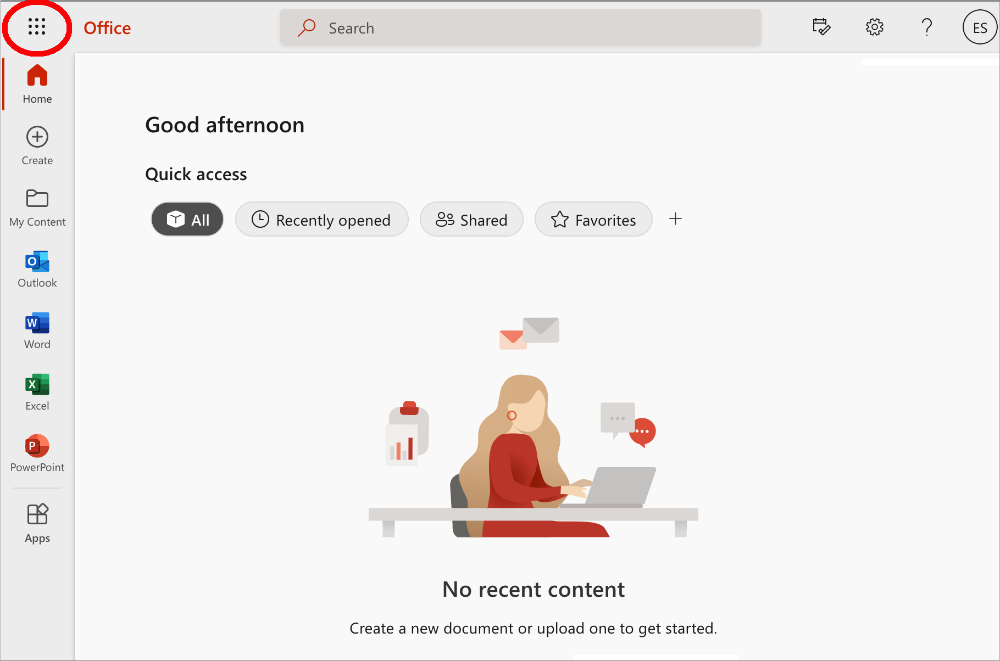
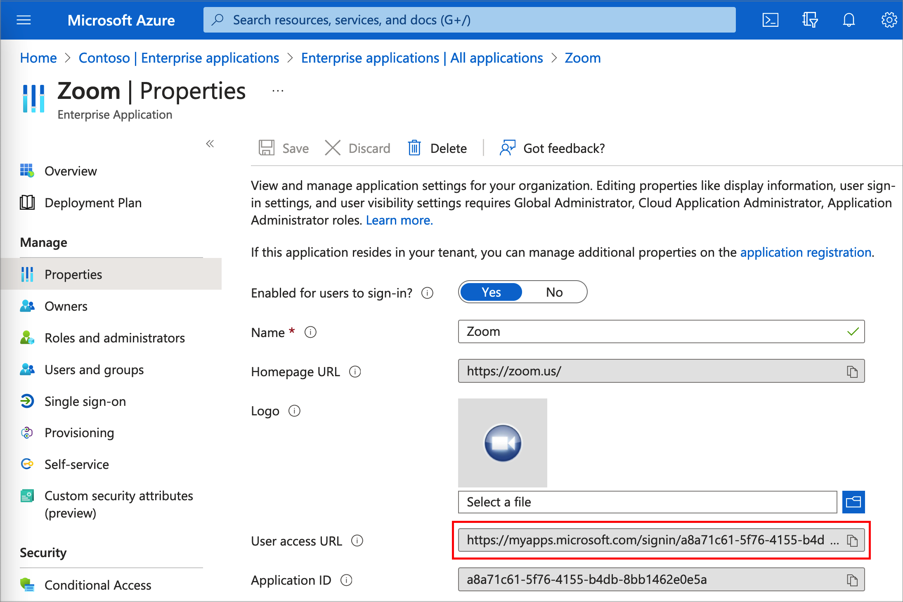
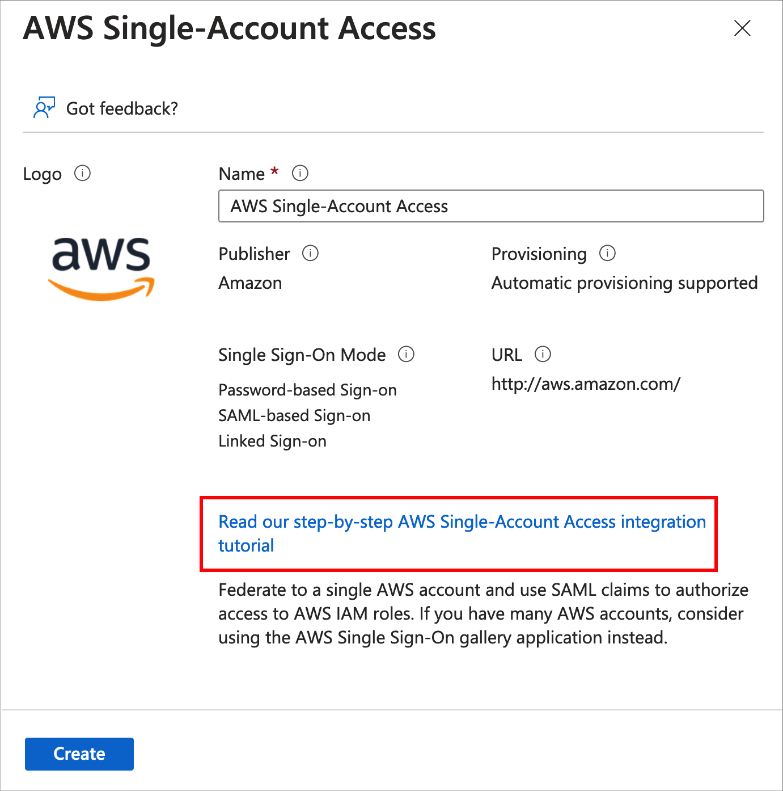
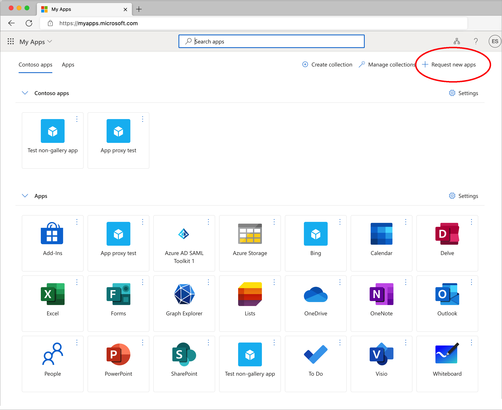
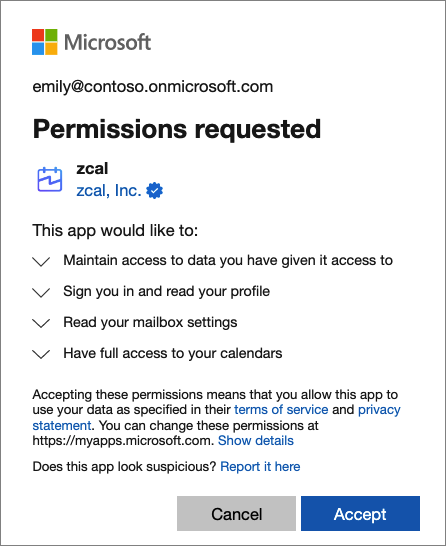
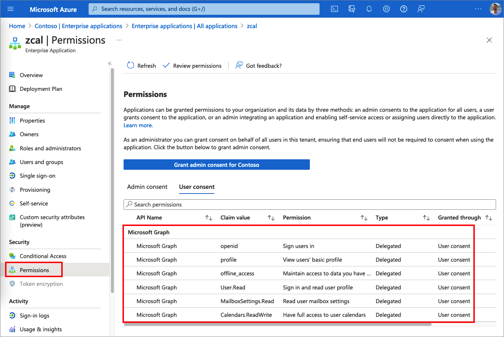

# Application management

## 1. Enterprise applications

Enterprise Application contains a list of your Service Principals. The Service principals are local instances of  applications published by other organizations into the [Azure AD app gallery](https://docs.microsoft.com/azure/active-directory/manage-apps/overview-application-gallery), or your own applications. 

There are several ways that you might manage applications in Azure AD:

- **App Gallery** 
    - A collection of pre-integrated Azure AD apps (a.k.a. cloud apps). The app gallery contains [thousands of applications](https://azuremarketplace.microsoft.com/en/marketplace/apps/category/azure-active-directory-apps) that make it easy to deploy and configure single sign-on (SSO) and [automated user provisioning](https://docs.microsoft.com/azure/active-directory//app-provisioning/user-provisioning). 
    
    - You can [publish applications](https://docs.microsoft.com/azure/active-directory/manage-apps/v2-howto-app-gallery-listing) you develop in the Azure AD app gallery. When you publish your applications, they're made publicly available for users to add to their tenants.

- **Non-gallery** - You can [add any application](https://docs.microsoft.com/azure/active-directory/manage-apps/plan-an-application-integration#capabilities-for-apps-not-listed-in-the-azure-ad-gallery) you don’t find in the app gallery. For example, an app that  already exists in your organization, or any third-party application from a vendor who is not already part of the Azure AD gallery.

-  **Registered applications** - custom developed apps using the Open ID Connect, OAuth, or SAML standards. These applications are added to your tenant using the _App registrations_ option on the Azure AD portal. 

- **Application Proxy** - applications [running in your on-premises environment](https://docs.microsoft.com/azure/active-directory/app-proxy/what-is-application-proxy) that you want to provide secure single-sign on to externally.

> Note, all enterprise apps have "Registered application". For gallery apps, the organization who published the app, registered it in their tenant. When you add a **Non-gallery** or **Application Proxy**, Azure AD creates an "App registration" for you. When you register an application, Azure AD B2C creates the enterprise application for you. 

After an application is created in an Azure AD tenant, users who have been [assigned](#52-user-and-group-assignment) to it can securely access it via my apps or Office 365 application launcher (check out the next topic).

## 2. User experiences

Azure AD provides several customizable ways to deploy applications to end users in an organization. This section describes how users can access enterprise applications. 

### 2.1 My Apps portal

Users access the apps via the My Apps <https://myapps.microsoft.com/>. The My App is a [web-based portal](https://docs.microsoft.com/azure/active-directory/manage-apps/myapps-overview) that is used for managing and launching applications in Azure Azure AD. The user selects the app from the list of available apps (for that user). If the app doesn't support [auto provisioning](https://docs.microsoft.com/azure/active-directory//app-provisioning/user-provisioning), or auto provisioning was not configured, the first time the user selects the app, the user will have to sign-up with the Azure AD account. Consecutive sign-ins utilize the SSO and the user won't be promoted to sign-in again.

#### 2.1.1 Collections

_Licensing_: P1 or P2

By default, all the applications a user can access are listed together on a single page. To better organize this page for your users, you can set up [collections](https://docs.microsoft.com/azure/active-directory/manage-apps/access-panel-collections). With collection, you can group together applications that are related (for example, by job role, task, or project) and display them on a separate tab.

The screenshot above shows two collections **Apps** (default), and **Contoso apps**. 

### 2.1.3 Enable preview features for My Apps

An organizations can enable, or disable public preview features in My Apps. To change the settings:. 

1. Sign in to the [Azure portal](https://portal.azure.com) or [Azure AD admin center](https://aad.portal.azure.com) as a Global Administrator, User Administrator, or Group Administrator.
1. Select **Azure Active Directory** > **User settings** > **User feature** > **Manage user feature settings**.
1. Select **Users can use preview features for My Apps**.

### 2.1.3 My Staff portal

[My Staff](https://docs.microsoft.com/azure/active-directory/roles/my-staff-configure) enables you to delegate permissions to a figure of authority, such as a store manager or a team lead, to ensure that their staff members are able to access their Azure AD accounts. Instead of relying on a central helpdesk, organizations can delegate common tasks such as resetting passwords or changing phone numbers to a local team manager.

Users who are enabled and have been assigned an administrative role can access it through <https://mystaff.microsoft.com>. They can select an administrative unit to view the users in that unit, and select a user to open their profile. Then they can:

- [Reset a user's password](https://docs.microsoft.com/azure/active-directory/roles/my-staff-configure#reset-a-users-password)
- [Manage a phone number](https://docs.microsoft.com/azure/active-directory/roles/my-staff-configure#manage-a-phone-number)
- [Can view audit logs for actions taken in My Staff in the Azure portal](https://docs.microsoft.com/azure/active-directory/roles/my-staff-configure#audit-logs)

The following screenshot shows how admin can manage its staff:

For more information, check out the [My Staff user guide](https://support.microsoft.com/account-billing/manage-front-line-users-with-my-staff-c65b9673-7e1c-4ad6-812b-1a31ce4460bd)

### 2.2 Microsoft 365 application launcher

For organizations that have deployed Microsoft 365, applications assigned to users through Azure AD will also appear in the Office 365 portal at <https://portal.office.com/myapps>. The Microsoft 365 application launcher makes it easy and convenient for users in an organization to launch their apps without having to use a second portal, and is the recommended app launching solution for organizations using Microsoft 365.

For more information about the Office 365 application launcher, see [Meet the Microsoft 365 app launcher](https://support.microsoft.com/office/meet-the-microsoft-365-app-launcher-79f12104-6fed-442f-96a0-eb089a3f476a).

### 2.3 Direct sign-in links

Azure AD also supports [direct single sign-on links](https://docs.microsoft.com/azure/active-directory/manage-apps/end-user-experiences#direct-sign-on-links) to individual applications that support password-based single sign-on, linked single sign-on, and any form of federated single sign-on.

These links are specifically crafted URLs that send a user through the Azure AD sign-in process for a specific application without requiring the user launch them from Azure AD My Apps or Microsoft 365.

These User access URLs can be found under the properties of available enterprise applications.

### 2.4 Service provider (app) initiated flow

Most applications that support SAML 2.0, or OpenID Connect protocol also support the ability for users to start at the application, and then get signed in through Azure AD. For example user can navigate to the <https://zcal.co/> app. Then, signs-in with the Azure AD credentials. All of the settings, such as consent, and permissions, or MFA (using conditional access) will be applied. For more information, check out [Direct sign-on to federated apps
](https://docs.microsoft.com/azure/active-directory/manage-apps/end-user-experiences#direct-sign-on-to-federated-apps).

## 3. Single sign-on

[Single sign-on](https://docs.microsoft.com/azure/active-directory/manage-apps/what-is-single-sign-on) is an authentication method that allows users to sign in using one set of credentials to multiple independent software systems. Using SSO means a user doesn't have to sign in to every application they use. With SSO, users can access all needed applications without being required to authenticate using different credentials.

There are several ways you can configure an application for SSO. Cloud applications can use OpenID Connect, OAuth, SAML, password-based, or linked for SSO. Single sign-on can also be disabled. A single cloud app may provide multiple SSO methods. This section describes the admin and user single sign-on flows. For more information, check out the [Plan a single sign-on deployment](https://docs.microsoft.com/azure/active-directory/manage-apps/plan-sso-deployment)

### 3.1 OpenID Connect protocol

For [OpenID Connect enterprise applications](https://docs.microsoft.com/azure/active-directory/manage-apps/add-application-portal-setup-oidc-sso), admin doesn't need to configure the SSO federation (unlike SAML apps). The admin selects the app from the gallery, then select **setup** to complete the sign-up process for the application. The admin signs in with Azure AD credentials. If admin already has a subscription to the application, then user details and tenant information is validated. Otherwise the admin will be redirected to sign up for the application service. 

### 3.2 SAML protocol

To add a SAML based enterprise application, find the app in the App Gallery, and follow the [guidance](https://docs.microsoft.com/azure/active-directory/saas-apps/tutorial-list) how to configure the enterprise application. The following screenshot shows the _Adobe Identity Management_ SAML app create page. 

  

Alternatively you can add any application that already exists in your organization, or any third-party application from a vendor who [is not already part of the Azure AD gallery](https://docs.microsoft.com/azure/active-directory/manage-apps/plan-an-application-integration#capabilities-for-apps-not-listed-in-the-azure-ad-gallery).

Users sign in to the application with SP-initiated and IDP-initiated flows.

#### 3.2.1 SAML Certificates

When you add a new SAML application from the gallery and configure a SAML-based sign-on, Azure AD generates a self-signed certificate for the application that is valid for three years. You can [manage the certificates](https://docs.microsoft.com/azure/active-directory/manage-apps/tutorial-manage-certificates-for-federated-single-sign-on) used for SAML signing and encryption.

#### 3.2.2 SAML token encryption

_Licensing_: P1 or P2

SAML [token encryption](https://docs.microsoft.com/azure/active-directory/manage-apps/howto-saml-token-encryption?tabs=azure-portal) enables the use of encrypted SAML assertions with an application that supports it.

### 3.3 Linked-based SSO

[Linked-based SSO](https://docs.microsoft.com/azure/active-directory/manage-apps/configure-linked-sign-on) doesn't provide sign-on functionality through Azure AD. This option simply sets the location that users are taken to when they select the application on the My Apps or Microsoft 365 portal.

To add a linked-based enterprise application, find the app in the App Gallery, add a non-gallery application.

### 3.4 Password-based SSO

With [password-based SSO](https://docs.microsoft.com/azure/active-directory/manage-apps/configure-password-single-sign-on-non-gallery-applications), a user signs in to the application with a username and password the first time it's accessed. User credentials are stored in an encrypted state in the directory. After the first sign-on, Azure AD sends the username and password to the application automatically for you.

To use password-based single sign-on (SSO) in My Apps, the browser extension must be installed. The extension downloads automatically when you select an app that's configured for password-based SSO. To learn about using My Apps from an end-user perspective, see [My Apps portal help](https://support.microsoft.com/account-billing/sign-in-and-start-apps-from-the-my-apps-portal-2f3b1bae-0e5a-4a86-a33e-876fbd2a4510).

## 4. Manage access to an application

### 4.1 App owners

An [owner of an enterprise application in Azure AD](https://docs.microsoft.com/azure/active-directory/manage-apps/overview-assign-app-owners), can manage the organization-specific configuration of the application, such as single sign-on, provisioning, and user assignment. An owner can also [add or remove other owners](https://docs.microsoft.com/azure/active-directory/manage-apps/assign-app-owners). Note, users can be owners of enterprise applications but groups can't be assigned as owners.

### 4.2 User, and group assignment

By default, [all users can access your enterprise applications](https://docs.microsoft.com/azure/active-directory/manage-apps/what-is-application-management#user-group-and-owner-assignment) without being assigned to them. However, if you want to assign the application to a set of users, your application requires user assignment. 

When you [assign a user](https://docs.microsoft.com/azure/active-directory/manage-apps/add-application-portal-assign-users) to an application, the application appears in the user's My Apps portal for easy access. If the application exposes roles, you can also assign a specific role to the user.

#### 4.2.1 Group-based assignment

_Licensing_: P1 or P2

Admin can assign a [group to the application](https://docs.microsoft.com/azure/active-directory/manage-apps/what-is-access-management#assigning-users-and-groups-to-an-app). Specific users' access is determined by whether they are members of the group at the time they try to access the application. Note, nested group memberships aren't supported.

#### 4.2.2 Self-service application assignment

_Licensing_: P1 or P2

[Self-service application assignment](https://docs.microsoft.com/azure/active-directory/manage-apps/myapps-overview#self-service-access) is a great way to allow users to self-discover applications, and optionally allow the business group to approve access to those applications.

Admin configure an app to allow users to request access to the application. Then select to which group should assigned users be added. This groups is added under the app **Users and groups**.

Once admin completes self-service application configuration, users can navigate to their My Apps portal and select **Request new apps** to find the apps that are enabled with self-service access. 

Business approvers also see a notification in their My Apps portal. You can enable an email notifying them when a user has requested access to an application that requires their approval 

### 4.3 Disable sign in

You can [disable sign-in for user](https://docs.microsoft.com/azure/active-directory/manage-apps/application-properties#enabled-for-users-to-sign-in). If you disable, no users are able to sign in to the application, even if they're assigned to it. Tokens aren't issued for the application. For more information, check out the [Disable how a user signs in for an application](https://docs.microsoft.com/azure/active-directory/manage-apps/disable-user-sign-in-portal) article.

### 4.4 Conditional Access policy

To make sure that only the people they assign to the application can securely sign in. You can configure a [conditional access policy](./conditional-access.md) for a group of users that enforces multi-factor authentication (MFA).

### 4.5 Restrict access to a tenant

With [tenant restrictions](https://docs.microsoft.com/azure/active-directory/manage-apps/tenant-restrictions), organizations can specify the list of tenants that users on their network are permitted to access. For example, an organization may want to allow access to their organization's Microsoft 365 applications, while preventing access to other organizations' instances of these same applications, even ones that the users may be guests in.

For example, the Contoso organization allows their employees to access Outlook or SharePoint online only for users who sign-in with Contoso or Fabrikam credentials. They will be be able to access the same app with other credentials, such as a user who sign-in with Woodgrove credentials. 

## 5. Consent

[Consent](https://docs.microsoft.com/azure/active-directory/manage-apps/consent-and-permissions-overview) is a process where users can grant permission for an app that acts of behalf of the user to access user's profiles and data (in some cases also organization's data). To indicate the level of access required, an app requests the **API permissions** it requires. For example, an app can request the permission to read a signed-in user's profile and the contents of the user's mailbox. The app will not be able to access that data unless the user consent the app to access the data. The permissions that allow this type of access are called "delegated permissions."

### 5.1 User consent settings

Admin can confiure whether non-administrator users are allowed to grant user consent to an app and what [conditions](https://docs.microsoft.com/azure/active-directory/manage-apps/consent-and-permissions-overview#user-consent-settings) must be met before an application can be consented to by a user. For more information, check out [configure how users consent to applications](https://docs.microsoft.com/azure/active-directory/manage-apps/configure-user-consent).

### 5.2 Admin consent

Depending on the permissions they require, some applications might require an administrator to be the one who grants consent. For example, application permissions can only be consented to by an administrator. Administrators can grant consent for themselves or for the entire organization. 

#### 5.2.1 Delegated access (access on behalf of a user)

For apps that access on behalf of other users. After an admin grants admin consent, users aren't usually prompted for consent for that app. In certain cases, a user might be prompted for consent even after consent was granted by an admin. An example might be if an app requests another permission that the admin hasn't already granted. 
  
Admin can grant [tenant-wide admin consent](https://docs.microsoft.com/azure/active-directory/manage-apps/grant-admin-consent), or [on behalf of a single user](https://docs.microsoft.com/azure/active-directory/manage-apps/grant-consent-single-user). [Configure group owner consent to applications](https://docs.microsoft.com/azure/active-directory/manage-apps/configure-user-consent-groups), [risk-based  consent](https://docs.microsoft.com/azure/active-directory/manage-apps/configure-risk-based--consent), [permission classifications](https://docs.microsoft.com/azure/active-directory/manage-apps/configure-permission-classifications) and more. 

For more information:

- [Introduction to permissions and consent](https://docs.microsoft.com/azure/active-directory/develop/permissions-consent-overview)
- [Permissions and consent in the Microsoft identity platform](https://docs.microsoft.com/azure/active-directory/develop/v2-permissions-and-consent)
- [Understanding Azure AD application consent experiences](https://docs.microsoft.com/azure/active-directory/develop/application-consent-experience)
- [Consent framework](https://docs.microsoft.com/azure/active-directory/develop/consent-framework)

#### 5.2.1.1 Admin consent workflow

The [admin consent workflow](https://docs.microsoft.com/azure/active-directory/manage-apps/admin-consent-workflow-overview) gives users a way to request admin consent for applications when they aren't allowed to consent themselves. For more information, check out the [Configure the admin consent workflow](https://docs.microsoft.com/azure/active-directory/manage-apps/configure-admin-consent-workflow) article.

#### 5.2.1 Direct access (App-only access)

For an app that are not act on behalf a user. In this access scenario, the [application acts on its own](https://docs.microsoft.com/azure/active-directory/develop/permissions-consent-overview#direct-access-app-only-access) with no user signed in. Application access is used in scenarios such as automation, and backup. This scenario includes apps that run as background services or daemons.

### 5.3 Hardening against consent phishing attacks

Consent phishing attacks trick users into granting permissions to malicious cloud applications. These malicious applications can then gain access to legitimate cloud services and data of users. Learn how to [hardening against consent phishing attacks](https://docs.microsoft.com/azure/active-directory/manage-apps/protect-against-consent-phishing).

### 5.4 User experience

Consent can be initiated in various ways. Users can be prompted for consent when they [attempt to sign in to an application](https://docs.microsoft.com/azure/active-directory/manage-apps/consent-and-permissions-overview#user-consent) for the first time (or when the app permissions have be changed). User's consents are recorded and they don't have to consent again on future sign-ins to the same app with the same set of permissions.

The following screenshot shows a consent request by the zcal cloud app. 

You can find the app permissions in Azure Portal, and concent for the users in your organization. After the admin consented, the user will not be prompted.

Some apps might require an administrator to be the one who grants consent for the users. For example, application permissions can only be consented to by an administrator. In this case the user will not be prompted.

## 6. Automate provisioning

The [application provisioning](https://docs.microsoft.com/azure/active-directory/app-provisioning/user-provisioning) allows organization to automatically create or remove user identities and roles **in the applications** that users need to access. Common scenarios include provisioning an Azure AD user into SaaS applications like Dropbox, Salesforce, ServiceNow, and more.

The automation provisioning allows you to automatically create new accounts in an app for new people when they join your team or organization, so they will be able to sign-in into the app. Automate deprovisioning when people leave the team or organization. Provision groups to applications that support them, amd more. 

### 6.1 Provisioning to SCIM-enabled apps

_Licensing_: P1 or P2

For apps that support [Cross-domain Identity Management (SCIM)](https://docs.microsoft.com/azure/active-directory/app-provisioning/user-provisioning#what-is-scim), you can use the Azure AD Provisioning agent to [directly connect](https://docs.microsoft.com/azure/active-directory/app-provisioning/on-premises-scim-provisioning) with your application and automate provisioning and deprovisioning. 

If you have legacy applications that don't support SCIM and rely on an [LDAP](https://docs.microsoft.com/azure/active-directory/app-provisioning/on-premises-ldap-connector-configure) user store or a [SQL database](https://docs.microsoft.com/azure/active-directory/app-provisioning/tutorial-ecma-sql-connector), Azure AD can support those as well.

## 7. Migrate to the cloud

Many organizations have Software as a Service (SaaS) or custom line-of-business apps federated directly to AD FS, alongside Microsoft 365 and Azure AD-based apps. Learn how to [move application authentication to Azure Active Directory](https://docs.microsoft.com/azure/active-directory/manage-apps/migrate-adfs-apps-to-azure)

### 7.1 Discover and manage shadow IT in your network

To get the full benefit of cloud apps and services, an IT team must find the right balance of supporting access while maintaining control to protect critical data. Learn how to [Discover the apps used by your organization](https://docs.microsoft.com/azure/active-directory/manage-apps/cloud-app-security)

## 8. For developers

### 8.1 App roles

Role-based access control (RBAC) is a popular mechanism to enforce authorization in applications. RBAC allows administrators to grant permissions to roles rather than to specific users or groups. The administrator can then assign roles to different users and groups to control who has access to what content and functionality.

An admin [defines app roles](https://docs.microsoft.com/azure/active-directory/develop/howto-add-app-roles-in-azure-ad-apps#declare-roles-for-an-application) with the [app registration settings](https://docs.microsoft.com/azure/active-directory/develop/quickstart-register-app). Once the admin has added app roles in the application, they can [assign users and groups to the roles](https://docs.microsoft.com/azure/active-directory/develop/howto-add-app-roles-in-azure-ad-apps#assign-users-and-groups-to-roles).

After defining the app roles and assigning users or groups to them, access the role assignments in the tokens coming into the application and act on them accordingly. Learn how to [implement RBAC in ASP.NET Core, Angular and Node.js](https://docs.microsoft.com/azure/active-directory/develop/howto-implement-rbac-for-apps)

#### 8.1.1 App roles vs. groups

Though you can use app roles or groups for authorization, key differences between them can influence which you decide to use for your scenario. Learn about the different between [using app roles and security groups](https://docs.microsoft.com/azure/active-directory/develop/howto-add-app-roles-in-azure-ad-apps#app-roles-vs-groups)

#### 8.1.2 App roles vs. scopes

The [scopes](https://docs.microsoft.com/azure/active-directory/develop/v2-permissions-and-consent) define the permission **for an app** that acts of behalf of the user, to access user's profiles and data (in some cases also organization's data). The user or an admin need to [consent](#5-consent) the permission request by the app.

[Application roles](https://docs.microsoft.com/azure/architecture/multitenant-identity/app-roles) are used to assign permissions **to users**. For example users with _Administrator_ role can perform all CRUD operations. Users with _Edit_ role, can create and view items in the app. Users with _Read_ role, can only read items in the app.

Using the app roles, the app admin defines the application roles by adding them to the application manifest. Then [assign users or group](https://docs.microsoft.com/azure/active-directory/develop/howto-add-app-roles-in-azure-ad-apps#assign-users-and-groups-to-roles) permission to app roles. When a user signs in, the user's assigned roles are sent as claims in the token. 

The developer of the application is responsible to check the roles claim that Azure AD returns the app, and enable or disable some of the app functionality accordingly.