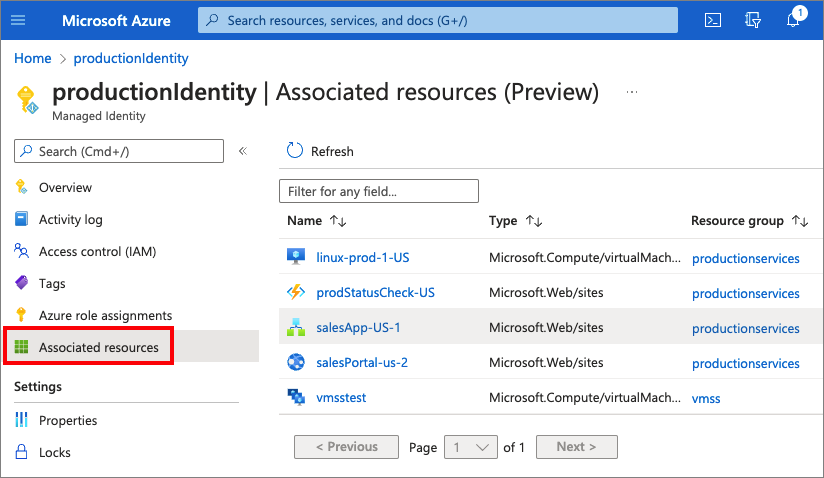

# Managed identities for Azure resources

A common challenge for developers is the management of secrets, credentials, certificates, and keys used to secure communication between services. [Managed identities](https://docs.microsoft.com/azure/active-directory/managed-identities-azure-resources/overview) eliminate the need for developers to manage these credentials.

Managed identities provide an automatically managed identity in Azure AD for applications to use when connecting to resources that support Azure AD authentication. Applications can use managed identities to obtain Azure AD tokens without having to manage any credentials.

For better understanding, and a demo using manage identities, watch the video in [the overview article](https://docs.microsoft.com/azure/active-directory/managed-identities-azure-resources/overview)

## Managed identity types

There are two types of managed identities:

- **System-assigned**. Some Azure services allow you to enable a managed identity directly on a service instance. When you enable a system-assigned managed identity, an identity is created in Azure AD. The identity is tied to the lifecycle of that service instance. When the resource is deleted, Azure automatically deletes the identity for you. By design, only that Azure resource can use this identity to request tokens from Azure AD.
- **User-assigned**. You may also create a managed identity as a standalone Azure resource. You can create a user-assigned managed identity and assign it to one or more instances of an Azure service. For user-assigned managed identities, the identity is managed separately from the resources that use it.

## Tutorials

Azure Windows virtual machines, or Azure virtual machine scale sets:

- [Access to Azure Data Lake Store](https://docs.microsoft.com/azure/active-directory/managed-identities-azure-resources/tutorial-windows-vm-access-datalake)
- [Access to Azure Storage](https://docs.microsoft.com/azure/active-directory/managed-identities-azure-resources/tutorial-vm-windows-access-storage)
- [Access to Azure SQL](https://docs.microsoft.com/azure/active-directory/managed-identities-azure-resources/tutorial-windows-vm-access-sql)
- [Access to Azure Key Vault](https://docs.microsoft.com/azure/active-directory/managed-identities-azure-resources/tutorial-windows-vm-access-nonaad)
- [Access to Azure Resource Manager](https://docs.microsoft.com/azure/active-directory/managed-identities-azure-resources/tutorial-windows-vm-ua-arm)

Azure Linux virtual machines, or Azure virtual machine scale sets:

- [Access to Azure Data Lake Store](https://docs.microsoft.com/azure/active-directory/managed-identities-azure-resources/tutorial-linux-vm-access-datalake)
- [Access ot Azure Storage](https://docs.microsoft.com/azure/active-directory/managed-identities-azure-resources/tutorial-linux-vm-access-storage)
- [Access to Azure Storage via access key](https://docs.microsoft.com/azure/active-directory/managed-identities-azure-resources/tutorial-linux-vm-access-storage-access-key)
- [Access to Azure Storage via a SAS credential](https://docs.microsoft.com/azure/active-directory/managed-identities-azure-resources/tutorial-linux-vm-access-storage-sas)
- [Access to Azure Key Vault](https://docs.microsoft.com/azure/active-directory/managed-identities-azure-resources/tutorial-linux-vm-access-nonaad)
- [Access to an Azure container registry](https://docs.microsoft.com/azure/container-registry/container-registry-authentication-managed-identity?context=%2Fazure%2Factive-directory%2Fmanaged-identities-azure-resources%2Fcontext%2Fmsi-context&tabs=azure-cli)
- [Access to Azure Resource Manager](https://docs.microsoft.com/azure/active-directory/managed-identities-azure-resources/msi-tutorial-linux-vm-access-arm)

Services:

- [How to use managed identities to connect to Cosmos DB from an Azure virtual machine](https://docs.microsoft.com/azure/active-directory/managed-identities-azure-resources/tutorial-vm-managed-identities-cosmos?tabs=azure-portal)
- [Authenticate a managed identity with Azure Active Directory to access Azure Service Bus resources](https://docs.microsoft.com/azure/service-bus-messaging/service-bus-managed-service-identity?context=%2Fazure%2Factive-directory%2Fmanaged-identities-azure-resources%2Fcontext%2Fmsi-context)
- [How to use managed identities for App Service and Azure Functions](https://docs.microsoft.com/azure/app-service/overview-managed-identity?context=%2Fazure%2Factive-directory%2Fmanaged-identities-azure-resources%2Fcontext%2Fmsi-context&tabs=portal%2Chttp)
- [Authenticate a managed identity with Azure Active Directory to access Event Hubs Resources](https://docs.microsoft.com/azure/event-hubs/authenticate-managed-identity?context=%2Fazure%2Factive-directory%2Fmanaged-identities-azure-resources%2Fcontext%2Fmsi-context&tabs=latest)
- [How to use managed identities with Azure Container Instances](https://docs.microsoft.com/azure/container-instances/container-instances-managed-identity?context=%2Fazure%2Factive-directory%2Fmanaged-identities-azure-resources%2Fcontext%2Fmsi-context)

## View update and sign-in activities

As an administrator your can [View updates made to user-assigned managed identities](https://docs.microsoft.com/azure/active-directory/managed-identities-azure-resources/how-to-view-managed-identity-activity), [View role assignments added and removed for managed identities](https://docs.microsoft.com/azure/active-directory/managed-identities-azure-resources/how-to-view-managed-identity-activity#view-role-assignments-added-and-removed-for-managed-identities), or [View authentication attempts by managed identities](https://docs.microsoft.com/azure/active-directory/managed-identities-azure-resources/how-to-view-managed-identity-activity#view-authentication-attempts-by-managed-identities)

## View resources for a user-assigned managed identity

You quickly see which [Azure resources are associated with a user-assigned managed identity](https://docs.microsoft.com/azure/active-directory/managed-identities-azure-resources/how-to-view-associated-resources-for-an-identity) gives you greater visibility into your environment. 

You can identify unused identities that can be safely deleted, and know which resources will be affected by changing the permissions or group membership of a managed identity.